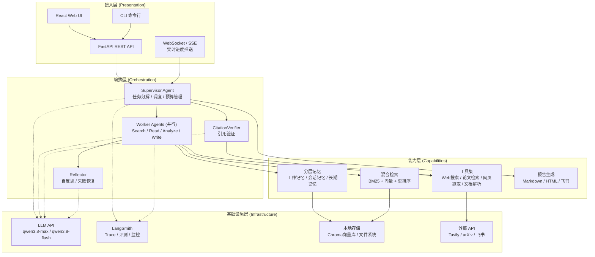
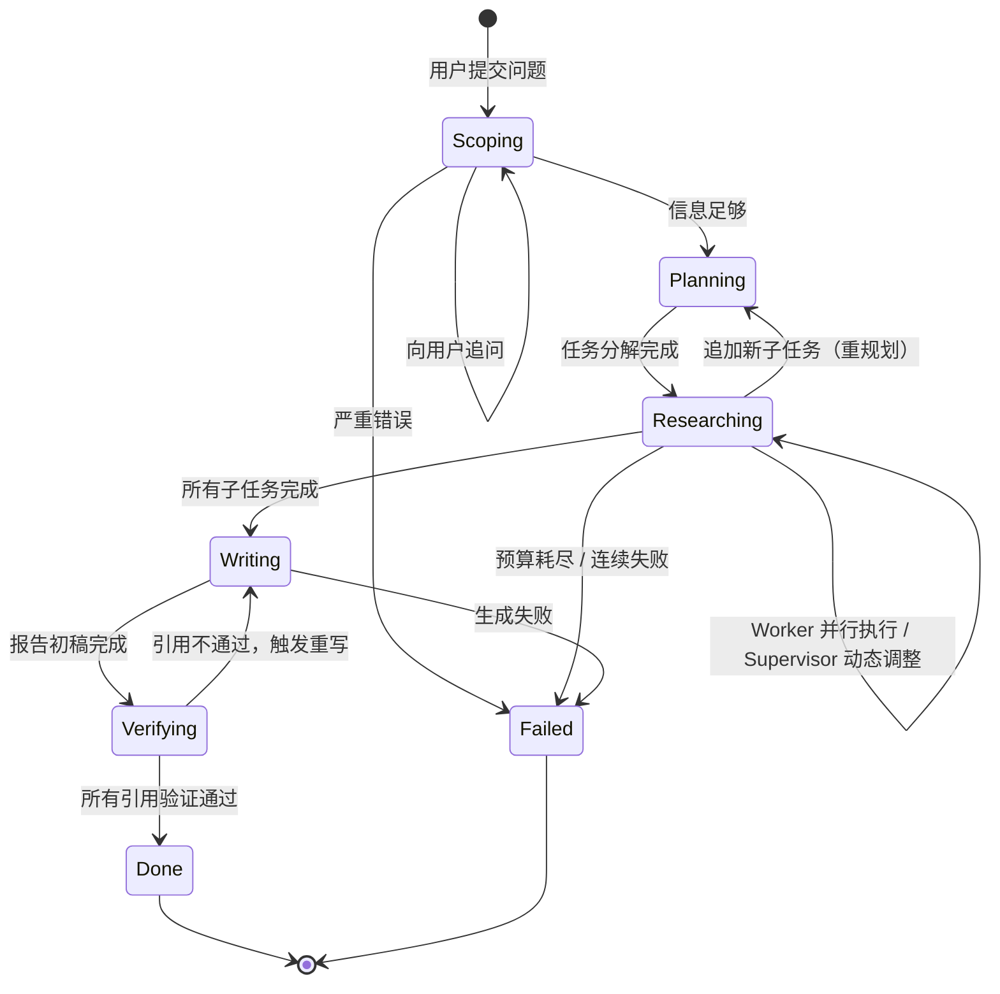
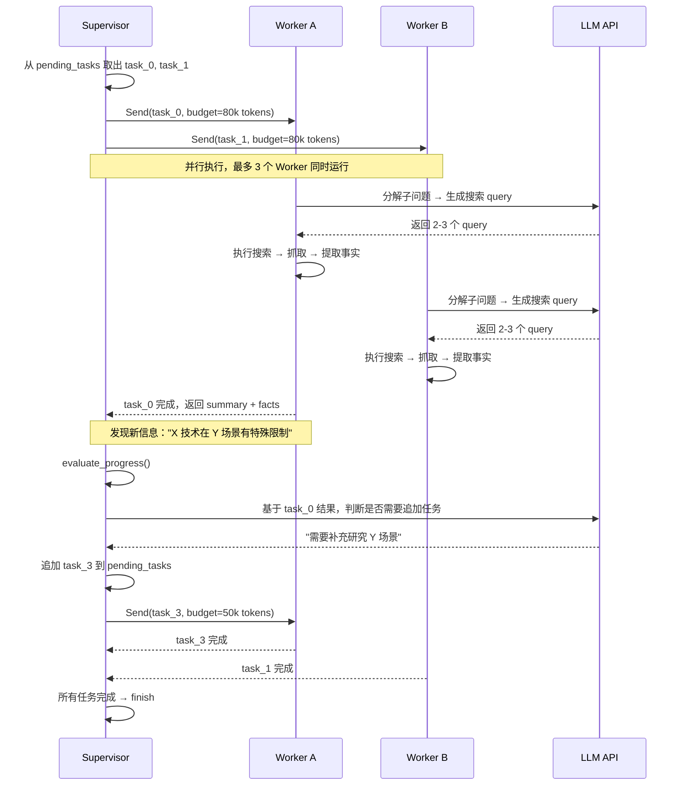
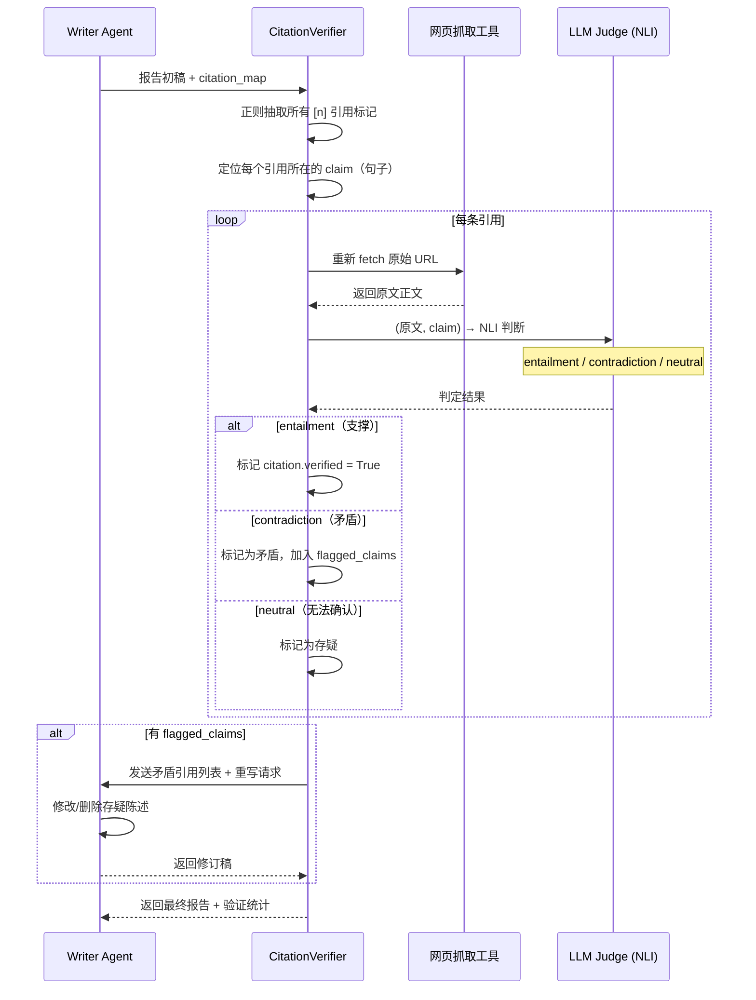
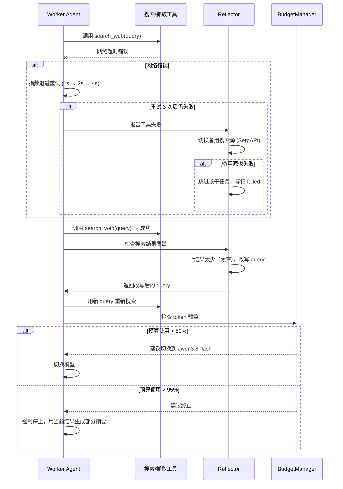
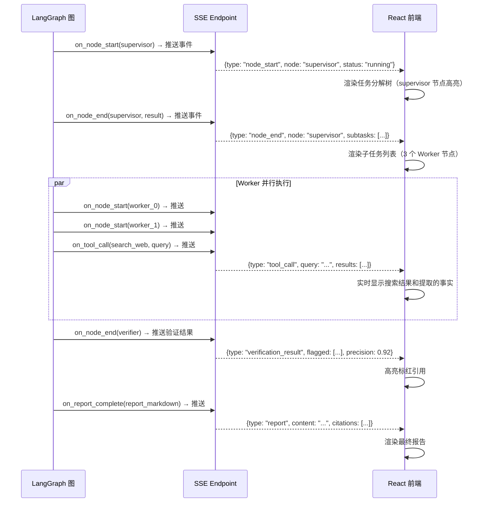

# TechResearch Agent 技术设计文档

> **项目代号**：TechResearch Agent（TRA）
> **版本**：v0.2（修订版）
> **撰写日期**：2026-09-17
> **目标周期**：约 12 周（3 个月），面向 2027 届秋招面试
> **最终交付**：公开 GitHub 仓库 + 本设计文档 + 可运行 Web 应用 + 评测报告

---

## 目录

- [第 1 章：项目概述与定位](#第-1-章项目概述与定位)
- [第 2 章：整体架构设计](#第-2-章整体架构设计)
- [第 3 章：LangGraph 状态 Schema 设计](#第-3-章langgraph-状态-schema-设计)
- [第 4 章：核心模块详细设计](#第-4-章核心模块详细设计)
- [第 5 章：工具层设计](#第-5-章工具层设计)
- [第 6 章：关键时序图](#第-6-章关键时序图)
- [第 7 章：API 设计（FastAPI）](#第-7-章api-设计fastapi)
- [第 8 章：前端设计（React）](#第-8-章前端设计react)
- [第 9 章：评测设计](#第-9-章评测设计)
- [第 10 章：可观测性设计](#第-10-章可观测性设计)
- [第 11 章：配置与环境变量](#第-11-章配置与环境变量)
- [第 12 章：用户手动操作清单](#第-12-章用户手动操作清单)
- [第 13 章：目录结构](#第-13-章目录结构)
- [第 14 章：12 周路线图](#第-14-章12-周路线图)
- [第 15 章：MVP 与进阶能力边界](#第-15-章mvp-与进阶能力边界)
- [第 16 章：风险与应对](#第-16-章风险与应对)
- [第 17 章：面试讲法](#第-17-章面试讲法)
- [第 18 章：来源与观点映射](#第-18-章来源与观点映射)

---

## 第 1 章：项目概述与定位

### 1.1 项目名称

**TechResearch Agent**（简称 TRA）—— 一个面向技术方案调研的开源 Deep Research Agent。

取名理由：简洁、语义明确（"技术研究"），与项目核心定位"技术选型/架构决策/可行性报告"直接对应，面试时一句话说清。

### 1.2 一句话定位

> **一个基于 LangGraph Supervisor-Worker 架构的开源技术调研 Agent，核心亮点是工具化的引用回查验证（CitationVerifier）+ 自行实现的调度逻辑 + 可复现的评测验证。**

### 1.3 解决什么痛点

技术人员在做技术选型或架构决策时，面临三个真实痛点：

1. **调研耗时**：一个技术选型问题（如"LangGraph vs LlamaIndex 哪个更适合做复杂 Agent"），手动搜索、阅读博客、对比 GitHub 项目、整理结论，通常需要 2-4 小时。
2. **信息分散**：答案散落在官方文档、博客、GitHub Issues、Reddit 讨论、论文中，手动整理容易遗漏关键信息。
3. **结论不可信**：AI 生成的调研报告经常出现"幻觉引用"——引用了不存在的 URL，或引用的原文并不支撑报告中的陈述。Cornell 2026 年的审计发现，仅 2025 年就有约 14.6 万条幻觉引用，其中 100 余条通过了 NeurIPS 2025 的同行评审。([来源](https://www.alphaxiv.org/overview/2605.07723))

TechResearch Agent 要解决的核心问题不是"能不能搜索"，而是**"搜索到的信息是否真的支撑最终结论"**。

### 1.4 与旧项目 Paper-Agent 的对比

旧项目 Paper-Agent（https://github.com/McFly-byte/Paper-Agent）是一个仅支持 arXiv 论文检索的轻量 Agent，作为本项目的**反例/迁移对照**。

| 维度 | 旧项目 Paper-Agent | 新项目 TechResearch Agent |
|---|---|---|
| **框架** | AutoGen + LangGraph 混合使用 | 纯 LangGraph 原生图（StateGraph + 节点） |
| **数据源** | 仅 arXiv API 单源 | Web 搜索（Tavily）+ arXiv + Semantic Scholar + 本地 PDF/Markdown |
| **编排模式** | 固定管线（搜索→摘要→报告），无反思 | Supervisor-Worker 嵌套图，动态任务分解 + 反思循环 |
| **引用验证** | 无（只聚合 arXiv 链接，不回查原文） | **CitationVerifier 节点**：重新 fetch 原文 → NLI 判断 → 标红/重写 |
| **可观测性** | 无 trace，靠 print 调试 | LangSmith 全链路 trace，每个节点/工具/LLM 调用可回放 |
| **评测** | 无 | DeepResearch Bench II + Bamboogle/BrowseComp 子集，4 层指标 + 消融实验 |
| **前端** | 有（Vue + Vite 前端 + SSE 流式输出，但仅展示进度和报告，无问题链可视化） | FastAPI + React 前后端分离，问题链可视化 + 实时进度 |
| **报告输出** | 仅 Markdown | Markdown + HTML + 飞书在线文档 |
| **记忆** | 无 | LangGraph Store + MemorySaver + 上下文压缩 |
| **成本治理** | 无 | 预算感知（全局/每任务 token 预算，超预算降级） |

> **面试话术**："旧项目暴露了三个核心问题——单数据源覆盖不全、固定管线不能反思调整、引用可信度无保障。新项目针对这三个问题分别升级为多源检索、Supervisor-Worker 动态编排、以及自研的 CitationVerifier 模块。"

### 1.5 目标用户与典型使用场景

**目标用户**：技术决策者——工程师、技术 Lead、架构师，在做技术选型或架构决策时需要快速获取有依据的调研报告。

**场景 1：技术选型对比**
> 用户输入："对比 LangGraph 和 LlamaIndex，哪个更适合构建多步推理的 Deep Research Agent？"
> Agent 自动分解为：① 两者架构对比 ② 社区生态对比 ③ 实际项目案例 ④ 学习曲线对比 → 并行调研 → 生成带引用的对比报告。

**场景 2：新技术可行性评估**
> 用户输入："LightRAG 相比传统向量 RAG 在技术调研场景有什么优势？成熟度如何？"
> Agent 检索论文、GitHub 项目、技术博客，输出可行性报告，包含技术原理、性能数据、社区活跃度、风险点。

**场景 3：竞品/开源项目调研**
> 用户输入："调研 2026 年主流开源 Deep Research Agent 项目（gpt-researcher、DeerFlow、STORM）的架构差异和各自优劣。"
> Agent 从 GitHub README、论文、技术博客多角度收集信息，输出结构化对比分析。

### 1.6 面试差异化亮点总结

1. **自研 CitationVerifier 引用回查验证模块**：从报告抽取所有引用声明 → 重新 fetch 原文 → LLM NLI 判断是否真支撑 → 不通过标红并重写。据公开文档和论文描述，gpt-researcher、STORM、LangGraph ODR 的引用处理以聚合 URL 为主，本项目进一步做了原文回查验证。
2. **自行实现 Supervisor-Worker 调度逻辑**：不直接用 LangGraph 官方 deep-research 示例的调度代码，而是自己实现状态机、预算感知、失败恢复，面试能讲透每一行设计决策。
3. **可复现的评测验证**：以 DeepResearch Bench II（132 任务/9430 rubric）为主评测集，4 层指标 + 消融实验 + 失败分析，用数据支撑每个设计决策的有效性。
4. **问题链可视化 UI**：实时展示 Supervisor 的任务分解树和每个 Worker 的检索过程，面试现场 demo 冲击力强。
5. **全链路可观测性**：LangSmith trace 覆盖每个节点/工具/LLM 调用，调试和讲故事都有数据支撑。

---

## 第 2 章：整体架构设计

### 2.1 架构总览

系统采用四层架构，自底向上为：基础设施层 → 能力层 → 编排层 → 接入层。



### 2.2 各层职责说明

| 层 | 职责 | 关键组件 |
|---|---|---|
| **接入层** | 接收用户输入、返回报告、推送实时进度 | FastAPI 路由、SSE/WebSocket、React 前端、CLI |
| **编排层** | 核心调度逻辑：任务分解、Worker 调度、引用验证、自反思 | Supervisor、Worker 子图、CitationVerifier、Reflector |
| **能力层** | 提供具体能力：搜索工具、记忆管理、检索增强、报告生成 | Tools、Memory、Retrieval、ReportGenerator |
| **基础设施层** | 底层依赖：模型 API、可观测性、存储、外部服务 | Qwen API、LangSmith、Chroma、Tavily/arXiv/飞书 |

### 2.3 端到端数据流

从用户输入到报告输出的完整流程：

1. **用户提交调研问题**（如"对比 LangGraph 和 LlamaIndex"），通过 FastAPI 创建调研任务。
2. **Scope 节点**：LLM 判断是否需要向用户追问（调研深度、范围、受众），若信息足够则继续。
3. **Planner/Supervisor 节点**：LLM 将原始问题分解为 3-5 个子研究任务（多视角），分配 token/时间预算。
4. **Worker 并行执行**：每个子任务分配给一个 Worker 子图，Worker 内部运行 ReAct 循环（搜索→阅读→提取→反思→继续/停止）。
5. **Supervisor 监控**：每个 Worker 完成后回传结果，Supervisor 评估是否需要追加新子任务或调整方向。
6. **报告撰写（Writer）**：所有子任务完成后，Writer Agent 根据所有 Worker 的提取事实和引用，生成结构化 Markdown 报告。
7. **引用验证（CitationVerifier）**：从报告中抽取所有引用声明，重新 fetch 原文，用 LLM NLI 判断引用是否真支撑陈述。不通过的标红并触发重写。
8. **报告输出**：将最终报告渲染为 Markdown / HTML / 飞书在线文档，推送给前端。
9. **全程 trace 上报**：每个节点、工具调用、LLM 调用都自动上报 LangSmith。

### 2.4 技术选型总表

| 组件 | 技术选型 | 版本 | 用途 | 选择理由 | 来源 |
|---|---|---|---|---|---|
| 编程语言 | Python | 3.11+ | 全栈后端 | LangGraph/LangChain 生态最成熟 | — |
| Agent 编排 | LangGraph | 最新稳定版 | 状态图编排 | 用户 LangGraph 能力 4/5，生态与 LangSmith 同构 | [LangGraph 文档](https://docs.langchain.com/oss/python/langgraph) |
| LLM（主） | qwen3.8-max | 快照 0902 | 规划/写作/验证 | 1M 上下文、131k 输出、支持 Function Calling 和结构化输出 | [百炼模型页](https://help.aliyun.com/zh/model-studio/qwen3-8-max) |
| LLM（降本） | qwen3.8-flash | 最新 | 总结/反思/压缩 | 同系列轻量版，成本更低 | 同上 |
| Embedding | text-embedding-v4 | 最新 | 向量化检索 | ¥0.5/百万 token，1024 维，100+ 语言 | [嵌入文档](https://help.aliyun.com/en/model-studio/embedding) |
| 重排序 | qwen3-rerank | 最新 | 检索结果精排 | 官方推荐 RAG 组合 | 同上 |
| Web 框架 | FastAPI | 最新 | REST API + SSE | Python 异步生态标准 | — |
| 前端框架 | React 18 + TypeScript | Vite 构建 | Web UI | 生态成熟，面试加分 | — |
| 前端 UI | TailwindCSS + shadcn/ui | 最新 | 样式与组件 | 快速开发，美观 | — |
| Web 搜索 | Tavily API | — | 联网搜索 | 免费 1000 次/月，专为 LLM 优化 | [Tavily](https://tavily.com/) |
| 论文检索 | arXiv API + Semantic Scholar | — | 学术论文检索 | 免费、覆盖广 | [arXiv API](https://info.arxiv.org/help/api/index.html) |
| 向量数据库 | Chroma | 最新 | 本地向量存储 | 零服务、本地文件、开发友好 | [Chroma](https://www.trychroma.com/) |
| 可观测性 | LangSmith Developer 免费版 | — | Trace / 评测 | 5k traces/月，零配置集成 LangGraph | [LangSmith](https://smith.langchain.com/) |
| 飞书集成 | lark-oapi | 最新 | 报告导出飞书文档 | 官方 SDK，Python | [lark-oapi](https://github.com/larksuite/oapi-sdk-python) |
| 评测框架 | DeepEval + RAGAS | 最新 | 评测指标计算 | Pytest 风格、RAG 专用指标 | [DeepEval](https://deepeval.com/) / [RAGAS](https://docs.ragas.io/) |
| 配置管理 | pydantic-settings | 最新 | 环境变量管理 | 类型安全、.env 支持 | — |

### 2.5 为什么选 LangGraph 而不是其他框架

| 框架 | 特点 | 为什么不选 / 为什么选 |
|---|---|---|
| **LangGraph** | 状态图、typed state、checkpoint、human-in-the-loop、与 LangSmith 零配置集成 | **选它**。用户 LangGraph 能力 4/5，学习成本最低；StateGraph 的 typed state 设计天然适合多 Agent 编排；checkpoint 功能免费自带任务中断恢复 |
| AutoGen | 对话式多 Agent，Agent 之间直接对话 | 旧项目用过，对话式调试困难；状态不可控；与 LangSmith 集成弱 |
| CrewAI | 角色驱动，流程简单 | 太高层，定制空间小；面试时无法讲透调度细节（这正是面试亮点） |
| LangChain Agent Executor | 单 Agent ReAct | 不支持多 Agent 并行和嵌套图，长程任务上下文爆炸 |

> **面试话术**："选 LangGraph 是因为它是唯一一个把'状态'作为一等公民的 Agent 框架。在 Deep Research 场景中，我们需要在 Supervisor 和多个 Worker 之间传递大量结构化状态（任务列表、搜索历史、提取的事实、引用列表），LangGraph 的 typed state + reducer 设计让这些状态流转显式且可观测。相比之下，AutoGen 的'对话'模式让状态隐式散落在消息历史里，调试困难。"

### 2.6 为什么核心调度与评测自行实现

**面试核心亮点**：不直接用 LangGraph 官方 deep-research 示例（Open Deep Research）的调度逻辑，而是自己实现。原因：

1. **面试能讲透**：如果直接用官方示例，面试时被追问"你的调度逻辑怎么设计的"就只能说"用了 LangGraph ODR"。自己实现后，每一行状态机、预算感知、失败恢复的设计决策都能讲清楚。
2. **差异化空间**：官方 ODR 是通用 Deep Research，我们针对"技术调研"场景做了特化（多视角提问、竞品对比表抽取、引用验证）。
3. **评测自行实现**：DeepResearch Bench II 的 rubric 评判逻辑需要自定义（技术调研场景的 rubric 可能与通用调查报告不同），自己写评测脚本比套现成框架更灵活。
4. **学习价值**：自己实现一遍 supervisor-worker 嵌套图、状态压缩、预算感知，比调包学到的多得多。

---

## 第 3 章：LangGraph 状态 Schema 设计

### 3.1 全局 State 定义

使用 Pydantic 模型定义所有状态字段。LangGraph 会自动将 Pydantic 模型作为 typed state 使用。

```python
# src/graph/state.py
from __future__ import annotations
from typing import Annotated, Literal, Optional
from pydantic import BaseModel, Field
from langgraph.graph.message import add_messages
from langchain_core.messages import BaseMessage


class Citation(BaseModel):
    """一条引用记录"""
    citation_id: str                    # 引用编号，如 "c1", "c2"
    url: str                            # 来源 URL
    title: str = ""                     # 页面标题
    snippet: str = ""                   # 引用片段（原文摘录）
    fetched_at: str = ""                # 抓取时间 ISO 8601
    verified: bool = False              # CitationVerifier 是否已验证
    verification_status: Literal["pending", "entailment", "contradiction", "neutral"] = "pending"
    verification_note: str = ""         # 验证备注（不通过时说明原因）


class Fact(BaseModel):
    """从搜索结果中提取的一条结构化事实"""
    fact_id: str                        # 事实 ID
    claim: str                          # 事实陈述，如"LangGraph 支持嵌套图"
    source_citation_ids: list[str] = Field(default_factory=list) # 支撑该事实的引用 ID 列表
    confidence: float = 0.0             # 置信度 0.0-1.0
    extracted_at: str = ""              # 提取时间


class SubTask(BaseModel):
    """一个子研究任务"""
    task_id: str                        # 任务 ID，如 "task_0"
    title: str                          # 任务标题，如"对比两者架构设计"
    description: str                    # 任务详细描述
    perspective: str = ""               # 视角标签（来自多视角分解）
    status: Literal["pending", "running", "completed", "failed", "budget_exceeded"] = "pending"
    assigned_worker: str = ""            # 分配的 Worker ID
    budget_tokens: int = 0              # 分配的 token 预算
    used_tokens: int = 0                # 已消耗 token
    result_summary: str = ""            # 任务完成后的摘要
    facts: list[Fact] = Field(default_factory=list)              # 提取的事实列表
    citations: list[Citation] = Field(default_factory=list)      # 引用列表


class ReportSection(BaseModel):
    """报告的一个章节"""
    section_id: str
    title: str
    content: str = ""                   # Markdown 内容
    citation_ids: list[str] = Field(default_factory=list)        # 本章引用的引用 ID
    verification_status: Literal["pending", "passed", "flagged"] = "pending"


class ResearchState(BaseModel):
    """
    全局研究状态 —— 贯穿整个调研任务的顶层 State。
    在 LangGraph 中作为 StateGraph 的 state schema 使用。
    """
    # === 用户输入 ===
    query: str = ""                          # 用户原始调研问题
    user_context: str = ""                   # 用户补充的背景信息（可选）
    research_depth: Literal["quick", "standard", "deep"] = "standard"  # 调研深度

    # === 任务管理 ===
    subtasks: list[SubTask] = Field(default_factory=list)  # 所有子任务列表
    current_stage: Literal["scoping", "planning", "researching", "writing", "verifying", "done", "failed"] = "scoping"

    # === 预算管理 ===
    max_total_tokens: int = 0                # 全局 token 预算
    used_total_tokens: int = 0                # 已消耗总 token
    max_search_rounds: int = 10              # 全局最大搜索轮次
    used_search_rounds: int = 0              # 已用搜索轮次

    # === 报告 ===
    report_outline: list[ReportSection] = Field(default_factory=list)  # 报告大纲
    report_content: str = ""                 # 最终报告 Markdown
    all_citations: list[Citation] = Field(default_factory=list)       # 所有引用汇总

    # === 记忆与上下文 ===
    messages: Annotated[list[BaseMessage], add_messages] = Field(default_factory=list)  # 对话消息历史
    conversation_summary: str = ""           # 上下文压缩后的摘要
    long_term_memory_ref: str = ""           # 长期记忆 Store 的 namespace 引用

    # === 元数据 ===
    task_id: str = ""                        # 任务唯一 ID
    created_at: str = ""                     # 创建时间
    error_log: list[str] = Field(default_factory=list)  # 错误日志
```

### 3.2 SupervisorState（编排层专用）

Supervisor 节点维护的扩展状态，聚焦于任务调度：

```python
# src/graph/supervisor_state.py
class SupervisorState(BaseModel):
    """Supervisor 编排状态 —— 从 ResearchState 派生，聚焦调度逻辑"""
    pending_tasks: list[SubTask] = Field(default_factory=list)     # 待执行任务队列
    running_tasks: list[SubTask] = Field(default_factory=list)      # 正在执行的任务
    completed_tasks: list[SubTask] = Field(default_factory=list)   # 已完成任务
    failed_tasks: list[SubTask] = Field(default_factory=list)       # 失败任务

    # 动态调整记录
    replan_count: int = 0                    # 重新规划次数
    max_replans: int = 2                     # 最大重规划次数（防止死循环）

    # 调度决策
    next_action: Literal["dispatch", "wait", "replan", "finish", "write_report"] = "dispatch"
    dispatch_plan: list[str] = Field(default_factory=list)  # 本轮要分发的 task_id 列表
```

### 3.3 WorkerState（子图状态）

每个 Worker 子图维护自己的状态，与 Supervisor 状态隔离：

```python
# src/graph/worker_state.py
class WorkerState(BaseModel):
    """Worker 子状态 —— 每个 Worker 独立的上下文窗口"""
    # 任务信息
    task_id: str = ""
    task_title: str = ""
    task_description: str = ""

    # 检索过程
    search_queries: list[str] = Field(default_factory=list)     # 已执行的搜索 query
    search_results: list[dict] = Field(default_factory=list)     # 搜索结果原始数据
    extracted_facts: list[Fact] = Field(default_factory=list)     # 提取的结构化事实
    collected_citations: list[Citation] = Field(default_factory=list)  # 收集的引用

    # 反思与循环控制
    reflection_notes: list[str] = Field(default_factory=list)     # 反思记录
    iteration: int = 0                                            # 当前迭代轮次
    max_iterations: int = 5                                       # 最大迭代次数
    should_stop: bool = False                                     # 是否停止循环
    stop_reason: str = ""                                         # 停止原因

    # 预算
    token_budget: int = 0                                         # 分配的 token 预算
    tokens_used: int = 0                                          # 已用 token

    # 输出
    summary: str = ""                                             # 该子任务的调研摘要
```

### 3.4 ReportState

报告撰写与验证阶段的状态：

```python
# src/graph/report_state.py
class ReportState(BaseModel):
    """报告生成与验证状态"""
    outline: list[ReportSection] = Field(default_factory=list)    # 报告大纲

    # 章节写作
    current_section_id: str = ""                                  # 当前正在写的章节
    draft_content: str = ""                                       # 当前草稿内容

    # 引用映射
    citation_map: dict[str, Citation] = Field(default_factory=dict)  # citation_id -> Citation
    claim_to_citations: dict[str, list[str]] = Field(default_factory=dict)  # claim -> citation_ids

    # 验证
    pending_verifications: list[str] = Field(default_factory=list)  # 待验证的 claim ID
    verified_claims: dict[str, Literal["entailment", "contradiction", "neutral"]] = Field(default_factory=dict)
    flagged_claims: list[str] = Field(default_factory=list)        # 被标记为矛盾的 claim ID

    # 最终输出
    final_markdown: str = ""                                      # 最终 Markdown 报告
    report_metadata: dict = Field(default_factory=dict)           # 报告元信息（字数、引用数等）
```

### 3.5 状态流转图



### 3.6 状态压缩策略

在长程调研中，消息历史和中间结果会迅速膨胀。设计以下压缩策略：

| 触发条件 | 压缩动作 | 压缩什么字段 |
|---|---|---|
| Worker 消息数 > 20 条 或 token > 8000 | 调用 `trim_messages` 裁剪旧消息 | WorkerState.messages 中的旧工具返回消息 |
| Worker 迭代 > 3 轮 | 对前 N 轮的搜索结果做 `summarize_node` | 将旧 search_results 压缩为 extracted_facts 列表，丢弃原始 JSON |
| Supervisor 汇总 > 5 个 Worker 结果 | 对 Worker 返回的 summary 做二次摘要 | 合并相似子任务的 result_summary |
| 全局 messages token > 50000 | 调用 `summarize_node` 生成 conversation_summary | 将旧消息压缩为一段摘要，保留最近 5 轮 |
| 上下文压缩后 | 用 `RemoveMessage` 从 state 中删除被压缩的消息 | 释放 token 空间，避免重复计费 |

**关键实现细节**：
- 使用 LangChain 的 `trim_messages` 函数，按 token 数裁剪，保留 system message 和最近 N 轮对话。
- 自定义 `summarize_node`：将旧消息列表传入 LLM，生成结构化摘要（包含关键事实、引用 ID、未解决问题），替换原始消息。
- 压缩是**有损但安全的**：摘要中保留所有 citation_id 和 fact_id，确保引用验证阶段仍能追溯到原文。


---

## 第 4 章：核心模块详细设计

### 4.1 动态研究计划模块（Planner / Supervisor）

**职责描述**：接收用户原始问题，分解为可并行执行的子研究任务，分配给 Worker 执行，监控进度并根据中间结果动态调整研究方向。

**接口定义**：

```python
# src/agents/supervisor.py
from typing import Literal
from graph.state import ResearchState, SubTask

class PlannerAgent:
    """动态研究计划 Agent"""

    def decompose_task(
        self,
        query: str,
        user_context: str = "",
        research_depth: Literal["quick", "standard", "deep"] = "standard",
    ) -> list[SubTask]:
        """
        将用户问题分解为 3-5 个子研究任务。

        输入:
            query: 用户原始调研问题，如"对比 LangGraph 和 LlamaIndex"
            user_context: 用户补充背景（可选）
            research_depth: 调研深度，决定子任务数量和预算

        输出:
            list[SubTask]: 分解后的子任务列表，每个任务带独立预算
        """
        ...

    def assign_budget(
        self,
        tasks: list[SubTask],
        total_budget_tokens: int,
    ) -> list[SubTask]:
        """
        为每个子任务分配 token 预算。
        策略：按任务重要性加权分配，核心对比任务分配更多预算。
        """
        ...

    def evaluate_progress(
        self,
        state: ResearchState,
    ) -> Literal["continue", "replan", "finish"]:
        """
        评估当前调研进度，决定是否继续、重规划或结束。
        - continue: 还有待执行任务，继续分发
        - replan: 已完成任务暴露了新的研究方向，需要追加任务
        - finish: 信息充分，可以进入写作阶段
        """
        ...

    def replan(
        self,
        state: ResearchState,
    ) -> list[SubTask]:
        """
        根据已完成 Worker 的中间结果，动态生成新的子任务。
        例如：Worker A 发现"X 技术在 Y 场景有特殊限制"，Supervisor 追加任务研究 Y 场景。
        """
        ...
```

**关键算法/逻辑**：

1. **任务分解策略**（参考 STORM 的 perspective generation）：
   - 第一步：LLM 先识别问题中的关键实体和维度。例如"LangGraph vs LlamaIndex"→ 实体[LangGraph, LlamaIndex]，维度[架构设计、生态、性能、学习曲线、适用场景]。
   - 第二步：为每个维度生成一个子任务，要求 LLM 输出对立视角（如"LangGraph 的优势"和"LlamaIndex 的优势"分别作为独立 Worker）。
   - 第三步：根据 research_depth 调整任务数量——quick=3 个子任务，standard=4-5 个，deep=6-8 个。

2. **Supervisor-Worker 编排模式**：
   - 顶层 LangGraph 图：`Scope → Research(子图) → Write(子图) → Verify(子图)`。
   - Research 阶段内部使用 Supervisor-Worker 嵌套图：Supervisor 节点决定分发哪些 Worker，Worker 子图并行执行。
   - **不直接用** `langgraph-supervisor-py` 包的路由逻辑，而是自己实现 `route()` 函数：根据 pending_tasks 队列和 Worker 并发上限，决定本轮分发哪些 Worker。
   - 并行执行策略：用 LangGraph 的 Send API 动态分发 Worker 任务，最多同时跑 3 个 Worker（API 限流考虑）。

3. **预算感知**：
   - 全局预算：`max_total_tokens`（如 500,000 token），`used_total_tokens` 实时累加。
   - 每任务预算：根据任务重要性分配（如核心对比任务 100k token，辅助任务 50k）。
   - 超预算降级：当 `used_total_tokens` 达到 80% 时，后续任务自动切换到 qwen3.8-flash（更便宜）；达到 95% 时，终止未开始的任务，提前进入写作阶段并在报告中注明"信息不足部分"。

**与其他模块的交互**：
- 调用 Planner LLM（qwen3.8-max）做任务分解。
- 通过 LangGraph Send API 分发 Worker 子图。
- 读取 Worker 返回的 SubTask.result_summary 和 facts，决定是否 replan。

**面试可讲点**：
- "任务分解不是一次性的——我设计了动态重规划机制，Worker 完成后 Supervisor 会评估是否需要追加新任务，这是对 gpt-researcher 固定管线的关键升级。"
- "预算感知不是事后记账——Supervisor 在分发任务时就分配了预算，Worker 内部每轮检索后检查剩余预算，超预算自动降级或终止。"

---

### 4.2 多智能体协作模块

**职责描述**：定义和实现各类 Worker Agent 的角色、Prompt 设计和协作机制。

**Agent 角色定义**：

| Agent 角色 | 职责 | 核心能力 |
|---|---|---|
| **SearchAgent** | 执行 Web/论文搜索，获取原始素材 | 构造搜索 query、调用搜索 API、筛选相关结果 |
| **ReadAgent** | 阅读抓取的网页/论文，提取结构化信息 | 长文本理解、事实提取、引用定位 |
| **AnalyzeAgent** | 对提取的事实做对比分析和趋势识别 | 多源信息交叉验证、对比表生成、矛盾识别 |
| **WriteAgent** | 撰写报告章节 | 根据事实和引用组织结构化报告 |

**每个 Agent 的 Prompt 设计要点**：

1. **SearchAgent Prompt 设计**：
   - 系统指令：你是一个技术调研搜索专家。给定一个研究子问题，生成 2-3 个精准的搜索 query。
   - 关键约束：query 必须具体、包含技术术语；避免过宽（如"LangGraph 怎么样"）和过窄（如"LangGraph 在 2026 年 9 月的 GitHub star 数"）。
   - 输出格式：JSON `{"queries": ["...", "..."]}`，使用 `with_structured_output`。

2. **ReadAgent Prompt 设计**：
   - 系统指令：你是一个技术文档阅读专家。阅读给定的网页内容，提取与研究问题相关的结构化事实。
   - 关键约束：每条事实必须附带原文引用片段（snippet）；不确定的事实标注 confidence < 0.5；不得编造文中没有的信息。
   - 输出格式：JSON `{"facts": [{"claim": "...", "snippet": "...", "confidence": 0.9}]}`。

3. **AnalyzeAgent Prompt 设计**：
   - 系统指令：你是一个技术分析专家。给定多个来源的事实，做交叉对比和综合分析。
   - 关键约束：必须指出不同来源之间的矛盾之处；必须标注分析的置信度；不得凭空推断。
   - 输出格式：JSON `{"comparisons": [...], "contradictions": [...], "insights": [...]}`。

4. **WriteAgent Prompt 设计**：
   - 系统指令：你是一个技术调研报告撰写专家。根据提供的事实和引用，撰写结构化的 Markdown 章节。
   - 关键约束：每个陈述必须附引用编号 `[n]`；引用编号必须与提供的引用列表对应；不得写入无引用支撑的陈述。
   - 输出格式：Markdown 文本 + 引用编号。

**Agent 间通信机制**：
- **不直接对话**，而是通过 LangGraph State 传递数据。
- SearchAgent → ReadAgent：SearchAgent 把 URL 列表写入 WorkerState.search_results，ReadAgent 从 state 中读取并抓取。
- ReadAgent → AnalyzeAgent：ReadAgent 把提取的 facts 写入 WorkerState.extracted_facts。
- Worker → Supervisor：Worker 子图结束时，把 summary、facts、citations 返回顶层 state。
- Supervisor → WriteAgent：Supervisor 汇总所有 Worker 的结果，写入顶层 state，WriteAgent 从顶层 state 读取。

**并行执行策略**：

```
可并行的 Worker：
  ├── Task 1: "LangGraph 架构特点"     ─┐
  ├── Task 2: "LlamaIndex 架构特点"     ─┼─ 同时执行（无依赖）
  ├── Task 3: "两者性能基准测试"       ─┘
  │
  └── Task 4: "综合对比与选型建议"     ── 依赖 Task 1+2+3 完成后才执行
```

- 无依赖的子任务（如分别调研两个竞品）：通过 LangGraph Send API 并行分发。
- 有依赖的子任务（如"综合对比"依赖前面所有调研）：Supervisor 检查依赖任务状态，完成后才分发。

**面试可讲点**：
- "Agent 之间不直接对话，全部通过 State 传递——这让每一步的数据流转都是显式的、可观测的、可回放的，比 AutoGen 的对话式协作更容易调试。"
- "并行不是无脑并行——我设计了依赖关系检查，对比分析类任务必须等所有信息收集类任务完成后才开始。"

---

### 4.3 引用/事实核验模块（CitationVerifier）—— 核心差异化亮点

> **这是本项目的核心差异化亮点之一。** 据公开文档和论文描述，gpt-researcher、STORM、LangGraph ODR 的引用处理以聚合 URL 为主，本项目重点实现引用回查验证（重新 fetch 原文 + NLI 判断），并通过基线对比和消融实验验证其效果。

**职责描述**：报告初稿生成后，自动验证报告中每一条引用是否真的支撑其所附的陈述。不通过的引用标红，触发重写。

**工作流程**：

```mermaid
flowchart LR
    A["报告初稿<br/>(Markdown)"] --> B["抽取所有 [n] 引用<br/>及其对应 claim"]
    B --> C["逐条 fetch 原始 URL<br/>获取原文内容"]
    C --> D["LLM NLI 判断<br/>entailment / contradiction / neutral"]
    D --> E{"验证结果"}
    E -->|entailment<br/>(支撑)| F["标记为已验证 ✓"]
    E -->|contradiction<br/>(矛盾)| G["标红 + 加入<br/>存疑引用清单"]
    E -->|neutral<br/>(无法确认)| H["标记为存疑<br/>提示用户"]
    G --> I["触发 Writer 重写<br/>该段落"]
    H --> I
    F --> J["输出最终报告"]
    I --> J
```

**详细步骤**：

1. **引用抽取**：用正则表达式从 Markdown 报告中匹配所有 `[n]` 格式的引用标记，定位每个引用标记所在的句子（claim）。同时从 ReportState.citation_map 中查找引用对应的 URL 和 snippet。

2. **重新 fetch 原文**：对每条引用，重新调用网页抓取工具（Trafilatura）获取原文正文。**注意**：不是用之前 Worker 抓取时缓存的 snippet，而是重新 fetch——因为 Worker 可能只抓取了片段，验证需要看完整上下文。

3. **NLI 判断**（Natural Language Inference，自然语言推理）：
   - 输入：`(原文正文, 报告中的 claim)` 对。
   - 输出三分类：
     - **entailment（蕴含）**：原文明确支持 claim → 验证通过。
     - **contradiction（矛盾）**：原文与 claim 冲突 → 验证不通过，标红。
     - **neutral（中立）**：原文既不支持也不矛盾 → 存疑，提示用户。
   - 使用 LLM（qwen3.8-max）做 NLI 判断，Prompt 设计如下：

```python
CITATION_VERIFICATION_PROMPT = """
你是一个引用验证专家。请判断以下"来源文本"是否真的支持"待验证陈述"。

【来源文本】（来自原始网页）：
{source_text}

【待验证陈述】（来自调研报告）：
{claim}

请判断来源文本是否支持待验证陈述。只输出以下之一：
- "entailment"：来源文本明确支持待验证陈述
- "contradiction"：来源文本与待验证陈述矛盾
- "neutral"：来源文本既不支持也不矛盾（信息不足）

判断依据：
1. 待验证陈述中的每个关键事实点是否都能在来源文本中找到对应？
2. 来源文本的上下文是否与待验证陈述的语境一致？
3. 注意：来源文本中没有提到的信息不等于矛盾，应判为 neutral。

只输出一个词：entailment / contradiction / neutral
"""
```

4. **不通过处理**：
   - contradiction：在报告中将该引用标记为红色（HTML 中加 `<span class="citation-flagged">`），在报告末尾生成"存疑引用清单"。
   - 触发 Writer 重写：将存疑 claim 和验证结果传给 Writer，要求修改或删除该陈述。
   - 最多重写 1 轮，避免无限循环。

**验证指标**：

| 指标 | 定义 | 计算方式 |
|---|---|---|
| **Citation Precision** | 引用的来源是否真的支撑所附陈述 | entailment 数 / 总引用数 × 100% |
| **Claim Coverage** | 报告中所有陈述中，被引用支撑的比例 | 有引用的陈述数 / 总陈述数 × 100% |
| **Hallucination Rate** | 幻觉引用比例 | contradiction 数 / 总引用数 × 100% |

**实现方式**：
- MVP：单模型 NLI（qwen3.8-max 做 judge）。
- 进阶：多模型交叉验证——用 qwen3.8-max 和另一个模型（如 qwen3.8-flash）分别判断，两个模型都判 entailment 才算通过，否则标记为存疑。

**与现有开源项目的对比**：

| 项目 | 引用处理方式 | 是否回查原文 |
|---|---|---|
| gpt-researcher | 聚合 URL，附在段落末尾 | 据官方文档描述未做原文回查（未逐行审计源码） |
| STORM | 聚合 URL，维基百科式引用 | 据论文描述以引用聚合为主（未逐行审计源码） |
| LangGraph ODR | 聚合 URL | 据官方示例代码描述未做原文回查（未逐行审计源码） |
| **TechResearch Agent** | **重新 fetch 原文 + NLI 验证 + 标红/重写** | **是** |

> **已核验事实边界**：
> - **我们核验了什么**：查阅了 gpt-researcher 的官方文档和 README 中描述的引用处理方式、STORM 论文中关于引用生成的描述、LangGraph ODR 示例代码的引用聚合逻辑。据这些公开材料，三者的引用处理以 URL 聚合为主。
> - **我们没有核验什么**：未对这三个项目做逐行源码审计，不能完全排除其最新版本中已加入回查功能的可能性。
> - **因此**：本项目不做"它们都不做引用验证"的绝对断言，而是表述为"据公开文档和论文描述，这些项目的引用处理以聚合为主，本项目进一步做了回查验证"。面试中如被追问，应如实说明核验范围。

**面试可讲点**：
- "幻觉引用是 Deep Research 领域的信任问题之一。Cornell 2026 年审计发现 2025 年单年 14.6 万条幻觉引用。据公开文档描述，现有开源项目的引用处理以聚合 URL 为主，我的 CitationVerifier 进一步做了原文回查验证。"
- "NLI 判断不是让模型'自说自话'——我把原文完整传入，让模型做 entailment 判断，这比字符串匹配更能理解语义层面的支撑关系。"
- "VeriFact-CoT 论文证明自验证不可靠，必须工具化——所以我的设计是重新 fetch 原文，而不是让 Writer 自己检查自己的引用。"

---

### 4.4 分层记忆与上下文压缩模块

**职责描述**：管理 Agent 的记忆层次，在长程调研中控制上下文长度，同时保留关键信息。

**记忆分层设计**：

| 记忆层次 | 存储内容 | 存储后端 | 生命周期 |
|---|---|---|---|
| **工作记忆** | 当前调研任务的中间结果（搜索历史、提取的事实、引用） | LangGraph State（内存） | 单次任务 |
| **会话记忆** | 用户偏好、历史对话摘要、之前的调研主题 | 开发环境：`MemorySaver`（纯内存，进程退出即丢失）；生产环境：`SqliteSaver`（本地文件持久化）或 `PostgresSaver`（服务端持久化） | 开发：进程内；生产：跨会话 |
| **长期记忆** | 跨项目的技术知识积累（用户关注的技术栈、历史调研结论） | LangGraph Store（namespace 级 KV） | 永久 |

**MVP 方案**：LangGraph 原生三件套

1. **会话记忆（Checkpointer）**：
   - 开发环境：`MemorySaver`（纯内存实现，进程退出即丢失，**仅适合开发调试**）。
   - 生产/持久化：`SqliteSaver`（本地文件持久化，推荐 MVP 使用）或 `PostgresSaver`（服务端持久化）。
   - 按 `thread_id` 存储 checkpoint，支持任务中断后从断点恢复。
   - 每个调研任务是一个独立的 thread。

2. **长期 KV 存储**：`InMemoryStore`（开发）→ `PostgresStore`+pgvector（生产）。
   - 按 namespace 分层存储，如 `user:{user_id}:preferences`、`project:{project_id}:findings`。
   - 存储用户偏好（如"偏好中文技术博客"）、历史调研结论摘要。

3. **上下文压缩**：
   - `trim_messages`：每轮调用 LLM 前，用 `trim_messages` 裁剪旧消息，保留最近 N 轮 + system message。
   - 自定义 `summarize_node`：当消息 token 超过阈值（如 8000）时，将旧消息压缩为结构化摘要，用 `RemoveMessage` 删除原始消息。

```python
# src/memory/context_compressor.py
from langchain_core.messages import trim_messages, RemoveMessage
from langchain_core.language_models import BaseChatModel

class ContextCompressor:
    """上下文压缩器"""

    def __init__(self, llm: BaseChatModel, max_tokens: int = 8000):
        self.llm = llm
        self.max_tokens = max_tokens

    def trim(self, messages: list) -> list:
        """简单裁剪：保留 system + 最近 N 条消息"""
        return trim_messages(
            messages,
            max_tokens=self.max_tokens,
            strategy="last",
            include_system=True,
            token_counter=len,  # 简化：按消息数，实际用 tiktoken
        )

    async def summarize_old_messages(self, messages: list) -> tuple[str, list]:
        """
        将旧消息压缩为摘要。
        返回 (summary_text, remove_operations)
        """
        # 把旧消息（除最近 5 条外）发给 LLM 生成摘要
        old_messages = messages[:-5]
        summary_prompt = f"""
        以下是调研过程中的对话历史，请生成一段结构化摘要，保留：
        1. 已提取的关键事实
        2. 已确认的引用来源 URL
        3. 尚未解决的问题

        对话历史：
        {old_messages}

        摘要：
        """
        summary = await self.llm.ainvoke(summary_prompt)

        # 返回 RemoveMessage 操作，删除被压缩的旧消息
        remove_ops = [RemoveMessage(id=m.id) for m in old_messages]
        return summary.content, remove_ops
```

**进阶方案**：叠加 Mem0

- Mem0（[GitHub](https://github.com/mem0ai/mem0)，Apache-2.0）自动从对话中抽取、去重、更新事实。
- 官方有 LangGraph 集成（`mem0/integrations/langgraph/`）。
- 在 LangGraph Store 之上叠加 Mem0，让长期记忆从手动 KV 存储升级为自动事实抽取。

**为什么不选 Zep/Letta**：
- Zep：需要额外的 Postgres + 图数据库服务，MVP 阶段过重。
- Letta（原 MemGPT）：是另一套完整的 Agent 运行时，与 LangGraph 生态不兼容，迁移成本高。
- Mem0 是纯库（默认本地 Chroma），侵入性最小，官方 LangGraph 集成开箱即用。

**面试可讲点**：
- "记忆分三层——工作记忆在 State 里，会话记忆用 Checkpointer（开发用 MemorySaver，持久化用 SqliteSaver），长期记忆用 Store 的 namespace。这是 LangGraph 官方推荐的模式，零新依赖。"
- "上下文压缩不是简单截断——我用 summarize_node 把旧消息压成结构化摘要，保留所有 citation_id 和 fact_id，确保引用验证阶段仍能追溯。"

---

### 4.5 自反思/失败恢复/预算感知模块

**职责描述**：让 Agent 具备自我评估、从错误中恢复、在预算约束下优雅降级的能力。

**自反思（Reflector）**：

每个 Worker 完成一轮检索后，Reflector 节点评估输出质量：

```python
# src/agents/reflector.py
class ReflectorAgent:
    """自反思 Agent"""

    async def reflect(
        self,
        query: str,
        search_results: list[dict],
        extracted_facts: list[Fact],
        open_questions: list[str],
    ) -> ReflectionResult:
        """
        评估本轮检索质量，决定下一步动作。

        输出:
            ReflectionResult:
                quality: Literal["sufficient", "too_broad", "too_narrow", "off_track"]
                next_query: str | None   # 反思式改写的下一个搜索 query
                should_stop: bool        # 是否停止检索
                reason: str              # 反思理由
        """
        ...
```

**反思式 query 改写**：
- 当搜索结果不相关时（quality = "off_track"），分析原因并改写 query：
  - "太宽"（too_broad）：搜索结果太多噪声 → 加入更具体的技术术语缩小范围。
  - "太窄"（too_narrow）：信息太少 → 扩展关键词或换用同义词。
  - "跑偏"（off_track）：结果与子主题无关 → 重新理解子任务描述，改写 query。
- 参考 RE-Searcher 论文的思路：搜索轨迹对 query 措辞极度敏感，显式反思能显著降方差。

**失败恢复策略**：

| 失败类型 | 检测方式 | 重试策略 | 降级策略 |
|---|---|---|---|
| 网络错误（搜索 API 超时） | 异常捕获 | 指数退避重试 3 次（1s, 2s, 4s） | 换备用搜索源（SerpAPI）或跳过该子任务 |
| API 限流（429） | HTTP 状态码 | 等待 Retry-After 头指定时间后重试 | 降低并发数，串行执行 Worker |
| LLM 输出格式错误 | 解析异常 | 重试 1 次，附错误说明让模型修正 | 降级为非结构化输出，后处理解析 |
| 搜索结果为空 | 结果列表为空 | 改写 query 重新搜索 | 标记该子任务信息不足，在报告中注明 |
| 连续反思 3 轮仍不够 | reflection_notes 长度 > 3 | — | 强制停止，用当前已有信息生成部分结果 |

**预算感知**：

```python
# src/core/budget_manager.py
class BudgetManager:
    """预算管理器"""

    def __init__(
        self,
        max_total_tokens: int = 500_000,
        max_search_rounds: int = 10,
        warning_threshold: float = 0.8,  # 80% 时开始警告
        critical_threshold: float = 0.95,  # 95% 时紧急降级
    ):
        self.max_total_tokens = max_total_tokens
        self.used_tokens = 0
        self.warning_threshold = warning_threshold
        self.critical_threshold = critical_threshold

    def check_budget(self) -> BudgetStatus:
        """
        检查当前预算状态，返回建议的动作。
        - normal: 正常执行
        - warning: 切换到便宜模型（qwen3.8-flash）
        - critical: 终止未开始的任务，提前进入写作
        """
        usage_ratio = self.used_tokens / self.max_total_tokens
        if usage_ratio >= self.critical_threshold:
            return BudgetStatus(action="critical_degrade", message="预算即将耗尽，终止非核心任务")
        elif usage_ratio >= self.warning_threshold:
            return BudgetStatus(action="switch_model", message="预算使用 80%，切换到 qwen3.8-flash")
        return BudgetStatus(action="normal", message="")
```

**状态持久化与中断恢复**：
- LangGraph 的 Checkpointer（开发用 MemorySaver，持久化用 SqliteSaver）自动保存 checkpoint（每个节点执行后）。
- 如果任务因网络中断或用户手动停止，可以从最近的 checkpoint 恢复。
- 恢复时从最新 checkpoint 读取 ResearchState，继续执行未完成的节点。

**面试可讲点**：
- "失败恢复不是简单重试——我设计了分级策略：网络错误指数退避重试，API 限流降并发，搜索无结果改写 query，连续 3 轮反思仍不够就强制停止。"
- "预算感知是主动的，不是事后记账——BudgetManager 在每个节点执行前检查，80% 就切换到便宜模型，95% 就提前终止，确保不会跑超预算。"

---

### 4.6 RAG / 混合检索模块

**职责描述**：从多种数据源检索相关信息，为报告生成提供上下文。

**检索源**：

| 数据源 | 接入方式 | 用途 |
|---|---|---|
| Web 搜索 | Tavily API | 技术博客、文档、论坛讨论 |
| 论文检索 | arXiv API + Semantic Scholar API | 学术论文、技术报告 |
| 本地文档 | 文件系统读取 | 用户上传的 PDF/Markdown |

**混合检索策略**：

1. **关键词检索（BM25）**：对搜索结果做关键词匹配，适合精确术语检索。使用 `rank_bm25` 库实现。
2. **向量检索**：将文档块通过 `text-embedding-v4` 向量化，存入 Chroma，余弦相似度检索。
3. **重排序（Reranker）**（可选）：用 `qwen3-rerank` 对混合检索结果做精排，提升 top-k 准确率。

```python
# src/retrieval/hybrid_retriever.py
class HybridRetriever:
    """混合检索器"""

    def __init__(self, vector_store, embedding_model, reranker=None):
        self.vector_store = vector_store      # Chroma 实例
        self.embedding_model = embedding_model  # text-embedding-v4
        self.reranker = reranker               # qwen3-rerank（可选）

    async def retrieve(
        self,
        query: str,
        top_k: int = 5,
        use_rerank: bool = True,
    ) -> list[RetrievedChunk]:
        """
        混合检索：BM25 + 向量检索 → 合并 → 可选重排序

        返回:
            list[RetrievedChunk]: 排序后的文档块，包含内容、来源、相似度分数
        """
        # 1. BM25 检索
        bm25_results = self._bm25_search(query, top_k=top_k * 2)

        # 2. 向量检索
        query_embedding = await self.embedding_model.aembed_query(query)
        vector_results = self.vector_store.similarity_search_by_vector(
            query_embedding, k=top_k * 2
        )

        # 3. 合并去重（RRF 融合）
        merged = self._reciprocal_rank_fusion(bm25_results, vector_results)

        # 4. 可选重排序
        if self.reranker and use_rerank:
            merged = await self.reranker.rerank(query, merged, top_k=top_k)

        return merged[:top_k]
```

**向量存储**：
- MVP：Chroma（本地文件存储，零服务依赖）。
- 进阶：可无缝切换到 LanceDB（更快）或 Qdrant（分布式）。

**分块策略**：
- **递归字符分块**（RecursiveCharacterTextSplitter）：先按段落分，太长再按句子分。
- chunk size：1000 token，overlap：200 token。
- 理由：技术文档中段落通常较长但信息密度高，1000 token 足以包含一个完整论点。

**检索增强写作**：
- WriteAgent 撰写每个章节前，先将章节标题作为 query 检索相关片段，注入写作 prompt 的 context 中。
- 检索结果作为"参考资料"传入，WriteAgent 基于这些资料写作，减少幻觉。

---

### 4.7 知识图谱模块（进阶）

**职责描述**：从调研结果中抽取实体和关系，生成技术实体关系图和竞品对比图。

**MVP 方案：不上图库**

- 用向量 RAG 做检索（已在 4.6 实现）。
- 让 LLM 在出报告时额外输出结构化 JSON：

```json
{
  "entities": [
    {"name": "LangGraph", "type": "framework", "description": "..."},
    {"name": "LlamaIndex", "type": "framework", "description": "..."}
  ],
  "relations": [
    {"source": "LangGraph", "target": "LangChain", "relation": "part_of"},
    {"source": "LangGraph", "target": "LlamaIndex", "relation": "competitor"}
  ],
  "comparisons": [
    {"dimension": "架构设计", "LangGraph": "...", "LlamaIndex": "..."}
  ]
}
```

- 前端将 JSON 渲染为可视化关系图和对比表。

**进阶方案：LightRAG**

- LightRAG（[HKUDS/LightRAG](https://github.com/HKUDS/LightRAG)，MIT 许可，[论文 arXiv:2410.05779](https://arxiv.org/abs/2410.05779)）。
- 纯 Python 库，默认 SQLite + FAISS 零服务依赖。
- 增量建图，dual-level 检索（实体级 + 关系级）。
- 包成 LangGraph 一个检索工具节点即可。

**知识图谱在技术调研中的用途**：
- 技术实体关系图：展示技术栈之间的依赖、竞争、互补关系。
- 竞品对比图：自动生成竞品维度对比表。
- 技术演进时间线：按时间排序的技术发展节点。

**为什么不选其他方案**：

| 方案 | 不选原因 |
|---|---|
| 微软 GraphRAG | 预跑社区报告成本过高（需要对所有文档做图谱构建 + 社区摘要），增量更新弱 |
| Neo4j | 需要常驻服务，MVP 阶段运维成本高 |
| Kuzu | 是嵌入式零件但不给自动建图流水线，需要自己写抽取逻辑 |

---

## 第 5 章：工具层设计

### 5.1 工具注册机制

使用 LangChain 的 `@tool` 装饰器注册工具，每个工具是一个函数，输入输出类型标注清楚。

```python
# src/tools/search_tools.py
from langchain_core.tools import tool

@tool
async def search_web(query: str, max_results: int = 5) -> list[dict]:
    """
    搜索 Web 上的技术博客、文档和论坛讨论。

    Args:
        query: 搜索关键词，如 "LangGraph vs LlamaIndex 对比"
        max_results: 返回结果数量，默认 5

    Returns:
        list[dict]: 每条结果包含 title, url, content, score
    """
    ...
```

### 5.2 Web 搜索工具

**Tavily API**（推荐）：
- 免费额度：1000 次/月。
- 专为 LLM 优化：返回清洗后的正文摘要，不需要再做网页解析。
- 接口：`tavily.search(query=..., max_results=5, include_raw_content=False)`

**备选 SerpAPI**：
- 免费额度：100 次/月。
- 返回 Google 搜索结果，原始 HTML 较多，需要额外解析。

```python
# src/tools/search_tools.py
import tavily

class TavilySearchTool:
    def __init__(self, api_key: str):
        self.client = tavily.TavilyClient(api_key=api_key)

    async def search(self, query: str, max_results: int = 5) -> list[dict]:
        response = self.client.search(
            query=query,
            max_results=max_results,
            search_depth="basic",  # 或 "advanced" 更深入但更贵
        )
        return [
            {
                "title": r["title"],
                "url": r["url"],
                "content": r["content"],
                "score": r.get("score", 0.0),
            }
            for r in response["results"]
        ]
```

### 5.3 论文检索工具

**arXiv API**（免费）：
- 接口：`http://export.arxiv.org/api/query?search_query=all:{query}&max_results=10`
- 返回 XML，解析为论文元数据（标题、作者、摘要、PDF 链接、发布日期）。

**Semantic Scholar API**（免费）：
- 接口：`https://api.semanticscholar.org/graph/v1/paper/search?query={query}&limit=10&fields=title,abstract,url,year,citationCount`
- 优势：提供引用数、被引论文列表，适合评估论文影响力。

```python
# src/tools/paper_tools.py
@tool
async def search_arxiv(query: str, max_results: int = 5) -> list[dict]:
    """
    搜索 arXiv 上的学术论文。

    Args:
        query: 搜索关键词，如 "deep research agent"
        max_results: 返回结果数量

    Returns:
        list[dict]: 每条包含 title, authors, abstract, pdf_url, published_date
    """
    ...
```

### 5.4 网页抓取工具

**MVP 方案**：`requests + Trafilatura`
- Trafilatura 是专门的正文提取库，比 BeautifulSoup 更准确地提取网页正文。
- 处理动态页面的备选方案：Playwright（可选，MVP 不做）。

```python
# src/tools/fetch_tools.py
import trafilatura

async def fetch_webpage(url: str, timeout: int = 10) -> dict:
    """
    抓取网页正文内容。

    Args:
        url: 网页 URL
        timeout: 超时秒数

    Returns:
        dict: {url, title, content, author, published_date}
    """
    downloaded = trafilatura.fetch_url(url)
    if downloaded is None:
        return {"url": url, "error": "fetch_failed"}

    result = trafilatura.extract(
        downloaded,
        output_format="json",
        include_links=True,
        include_images=False,
    )
    return json.loads(result) if result else {"url": url, "error": "parse_failed"}
```

### 5.5 本地文档解析

| 格式 | 解析库 | 说明 |
|---|---|---|
| PDF | PyMuPDF（fitz） | 速度快，支持文本和图片提取 |
| Markdown | 直接读取 | 纯文本，无需解析 |

### 5.6 GitHub 源码研究工具（设计预留，后续实现）

设计接口但不在 MVP 实现：

```python
# src/tools/github_tools.py (预留)
@tool
async def search_github_code(query: str, repo: str = "") -> list[dict]:
    """搜索 GitHub 代码"""
    ...

@tool
async def get_repo_info(owner: str, repo: str) -> dict:
    """获取 GitHub 仓库信息（star、最近提交、README）"""
    ...
```

### 5.7 MCP 工具封装（进阶）

用 FastMCP 将核心工具封装为 MCP Server，通过 `langchain-mcp-adapters` 接入 LangGraph：

```python
# mcp_server/server.py (进阶)
from fastmcp import FastMCP

mcp = FastMCP("deep-research-tools")

@mcp.tool()
async def search_web(query: str, max_results: int = 5) -> list[dict]:
    """搜索 Web"""
    ...

@mcp.tool()
async def fetch_page(url: str) -> dict:
    """抓取网页正文"""
    ...

if __name__ == "__main__":
    mcp.run()
```

**面试亮点**：MCP（Model Context Protocol）是 2025-2026 Agent 岗高频考点，能现场用 MCP Inspector 展示自研 Server 很加分。

### 5.8 工具调用的错误处理和超时设置

- 每个工具调用设置超时（搜索 10s，抓取 15s）。
- 超时后抛出 `ToolTimeoutError`，由 Worker 的失败恢复逻辑处理。
- 所有工具调用自动上报 LangSmith trace。


---

## 第 6 章：关键时序图

### 6.1 端到端调研流程

```mermaid
sequenceDiagram
    actor User as 用户
    participant API as FastAPI
    supervisor as Supervisor
    worker1 as Worker A
    worker2 as Worker B
    worker3 as Worker C
    verifier as CitationVerifier
    writer as Writer
    db as LangSmith

    User->>API: POST /api/research {query: "LangGraph vs LlamaIndex"}
    API->>supervisor: 创建任务，启动 StateGraph
    supervisor->>supervisor: Scope 节点（判断是否需要追问）
    supervisor->>supervisor: Planner 分解为 3 个子任务
    supervisor->>db: trace: planning 阶段完成

    par 并行执行 Worker
        supervisor->>worker1: Send(task_0: "LangGraph 架构")
        supervisor->>worker2: Send(task_1: "LlamaIndex 架构")
        supervisor->>worker3: Send(task_2: "性能对比")
    end

    par Worker 内部 ReAct 循环
        worker1->>worker1: search → read → extract → reflect
        worker2->>worker2: search → read → extract → reflect
        worker3->>worker3: search → read → extract → reflect
    end

    worker1-->>supervisor: 回传 summary + facts + citations
    worker2-->>supervisor: 回传 summary + facts + citations
    worker3-->>supervisor: 回传 summary + facts + citations

    supervisor->>supervisor: evaluate_progress（信息是否充分？）
    alt 信息不充分，需要追加任务
        supervisor->>supervisor: replan（追加新子任务）
        supervisor->>worker1: Send(task_3: "社区生态对比")
        worker1-->>supervisor: 回传结果
    end

    supervisor->>writer: 分发所有 facts + citations，撰写报告
    writer->>writer: 生成 Markdown 初稿
    writer-->>supervisor: 返回报告初稿

    supervisor->>verifier: 进入引用验证阶段
    loop 每条引用
        verifier->>verifier: 重新 fetch 原文
        verifier->>verifier: LLM NLI 判断（entailment/contradiction/neutral）
    end
    alt 有不通过的引用
        verifier-->>writer: 标记矛盾引用，触发重写
        writer->>writer: 重写存疑段落
    end
    verifier-->>supervisor: 返回验证结果 + 最终报告

    supervisor-->>API: 任务完成，报告就绪
    API-->>User: SSE 推送最终报告
```

### 6.2 Supervisor-Worker 协作与动态任务调整



### 6.3 引用验证流程



### 6.4 失败恢复流程



### 6.5 流式输出流程



---

## 第 7 章：API 设计（FastAPI）

### 7.1 API 架构

REST + SSE 混合架构：
- **REST**：创建任务、查询状态、获取报告、历史列表。
- **SSE（Server-Sent Events）**：实时推送任务进度、中间结果、最终报告。选择 SSE 而非 WebSocket，因为本场景是服务端→客户端单向推送，SSE 更轻量。

### 7.2 REST 端点列表

| 方法 | 路径 | 用途 | 请求体 | 响应体 |
|---|---|---|---|---|
| POST | `/api/research` | 创建调研任务 | `ResearchRequest` | `ResearchResponse`（含 task_id） |
| GET | `/api/research/{task_id}` | 获取任务状态 | — | `TaskStatusResponse` |
| GET | `/api/research/{task_id}/report` | 获取最终报告 | — | `ReportResponse`（Markdown 全文） |
| GET | `/api/tasks` | 历史任务列表 | — | `list[TaskSummary]` |
| GET | `/api/research/{task_id}/stream` | SSE 实时进度流 | — | SSE 事件流 |
| POST | `/api/research/{task_id}/export/feishu` | 导出到飞书文档 | — | `FeishuExportResponse` |
| GET | `/api/health` | 健康检查 | — | `{"status": "ok"}` |

### 7.3 请求/响应 Schema

```python
# src/api/schemas.py
from pydantic import BaseModel, Field
from typing import Literal, Optional

class ResearchRequest(BaseModel):
    """创建调研任务的请求"""
    query: str = Field(..., description="调研问题", examples=["对比 LangGraph 和 LlamaIndex"])
    user_context: str = Field("", description="用户补充背景（可选）")
    research_depth: Literal["quick", "standard", "deep"] = Field("standard", description="调研深度")
    data_sources: list[Literal["web", "arxiv", "local"]] = Field(
        ["web", "arxiv"], description="启用的数据源"
    )

class ResearchResponse(BaseModel):
    """创建调研任务的响应"""
    task_id: str
    status: Literal["pending", "running", "completed", "failed"]
    estimated_time_seconds: int = 0
    message: str = ""

class TaskStatusResponse(BaseModel):
    """任务状态响应"""
    task_id: str
    status: str
    current_stage: str
    progress: float = Field(0.0, description="0.0-1.0")
    subtasks: list[dict] = Field(default_factory=list)        # 子任务列表及状态
    used_tokens: int = 0
    total_cost_estimate: float = 0.0     # 预估成本（元）
    error_message: str = ""

class ReportResponse(BaseModel):
    """报告响应"""
    task_id: str
    markdown_content: str               # Markdown 全文
    citation_count: int                  # 引用总数
    verified_count: int                  # 已验证引用数
    flagged_count: int                  # 标红引用数
    citation_precision: float            # 引用验证通过率
    generated_at: str
```

### 7.4 流式输出设计（SSE）

SSE 事件类型：

```python
# src/api/sse_events.py
SSE_EVENTS = {
    "node_start": {
        "description": "某个 LangGraph 节点开始执行",
        "data": {"node": "supervisor", "task_id": "task_0"},
    },
    "node_end": {
        "description": "某个节点执行完成",
        "data": {"node": "worker_0", "result_summary": "..."},
    },
    "tool_call": {
        "description": "工具调用事件",
        "data": {"tool": "search_web", "query": "...", "results": [...]},
    },
    "reflection": {
        "description": "反思记录",
        "data": {"iteration": 2, "quality": "too_narrow", "next_query": "..."},
    },
    "verification_result": {
        "description": "引用验证结果",
        "data": {"citation_id": "c3", "status": "contradiction"},
    },
    "report_progress": {
        "description": "报告写作进度",
        "data": {"section": "架构对比", "percent": 50},
    },
    "task_complete": {
        "description": "任务完成",
        "data": {"report_url": "/api/research/task_123/report"},
    },
}
```

### 7.5 其他设计

- **认证**：MVP 不做认证（本地工具），预留 `X-API-Key` 中间件接口。
- **CORS**：配置允许 `http://localhost:5173`（Vite 开发服务器）跨域。
- **错误处理**：统一错误响应格式 `{"error": {"code": "...", "message": "...", "detail": "..."}}`。

---

## 第 8 章：前端设计（React）

### 8.1 技术栈

React 18 + TypeScript + Vite + TailwindCSS + shadcn/ui

### 8.2 页面结构

| 页面 | 路由 | 功能 |
|---|---|---|
| 首页/创建调研页 | `/` | 输入调研问题、选择调研深度、配置数据源 |
| 调研进度页 | `/research/:taskId` | 问题链可视化、实时日志、Worker 状态卡片 |
| 报告页 | `/research/:taskId/report` | Markdown 渲染、引用高亮、导出按钮 |
| 历史任务页 | `/history` | 历史调研任务列表 |

### 8.3 核心功能

**问题链可视化**：
- 树形结构展示 Supervisor 的任务分解。
- 每个节点显示状态：待执行（灰色）、进行中（蓝色脉冲动画）、已完成（绿色）、失败（红色）。
- 点击节点展开查看该 Worker 的搜索 query、提取的事实、反思记录。

**实时进度（SSE）**：
- 通过 `EventSource` API 接收 SSE 事件流。
- 渲染 Agent 的中间输出：搜索到的文章标题和摘要、提取的事实卡片、反思记录。

**报告渲染**：
- `react-markdown` 渲染 Markdown 内容。
- 引用标注 `[n]` 渲染为可点击的上标链接，hover 显示来源 tooltip（标题 + URL）。
- 验证不通过的引用标红，hover 显示"此引用未通过验证：原文与陈述矛盾"。

**导出功能**：
- Markdown 下载：直接生成 `.md` 文件下载。
- HTML 下载：将报告转为独立 HTML 文件下载。
- 发送到飞书：调用后端 `/api/research/{task_id}/export/feishu`，创建飞书文档并返回链接。

**状态管理**：
- React Query：服务端状态（任务列表、报告内容、SSE 事件）。
- Zustand：客户端状态（当前选中的任务、UI 主题、展开/折叠状态）。

---

## 第 9 章：评测设计

### 9.1 评测目标

证明 TechResearch Agent 的调研质量优于基线系统，且每个设计决策（引用验证、反思循环、多智能体）都有数据支撑。

### 9.2 主评测集：DeepResearch Bench II

| 项目 | 内容 |
|---|---|
| 全称 | DeepResearch Bench II: Diagnosing Deep Research Agents via Rubrics from Expert Reports |
| arXiv | [arXiv:2601.08536](https://arxiv.org/abs/2601.08536)（2026-01） |
| 任务数 | 132 个深度研究任务 |
| 领域数 | 22 个 topic domains |
| 评分细则 | 9,430 条专家撰写的二元（pass/fail）rubric |
| 评测方式 | LLM-as-judge 逐条判定 + 人机一致性校验 |
| 代码仓库 | [github.com/imlrz/DeepResearch-Bench-II](https://github.com/imlrz/DeepResearch-Bench-II) |
| **许可证** | **CC BY-NC-SA 4.0（非商用）** ⚠️ 个人项目和面试展示无问题 |
| 三维框架 | Information Recall（信息召回）/ Analysis（分析）/ Presentation（呈现） |

**适配性分析**：
- 技术选型调研任务与 Bench II 的"开放式深度调查/分析报告"高度匹配——都是多步联网检索 → 综合 → 结构化长报告。
- 22 个领域中，技术/计算机相关领域约占 15-20%，其余领域可测试跨领域泛化能力。
- **局限**：Bench II 不涉及写代码、跑测试、读 GitHub 仓库——纯技术选型中的"可行性验证"测不到。这是已知局限，在评测报告中注明。

**复现注意事项**：
- 任务源自公开专家文章，Agent 可能直接搜到原文"作弊"——在搜索工具层屏蔽来源专家文章域名。
- 需要联网环境 + LLM judge 调用成本（9,430 条 rubric 逐条判）。
- 建议先跑 20-30 题子集验证流程，再跑全集。

### 9.3 补充评测集

| 数据集 | 题数 | 角色 | 说明 |
|---|---|---|---|
| Bamboogle | 125 题 | 检索压力测试 | 题目设计为"直接 Google 搜不到答案"，必须多步推理 |
| BrowseComp 子集 | 10-20 题 | 检索能力测试 | OpenAI 出品，极难检索题，测 Agent 的搜索能力上限 |

### 9.4 评估指标（4 层）

| 层次 | 指标 | 含义 | 计算方式 |
|---|---|---|---|
| **1. 答案正确性** | Accuracy (LLM-judge) | 报告是否回答了原始问题 | LLM judge 二元判断 |
| | Rubric 通过率 | DeepResearch Bench II 每条 rubric 的 pass/fail 通过率 | 官方评测脚本 |
| **2. 检索质量** | Context Precision | 检索到的文档中有多少真正相关 | RAGAS 内置指标 |
| | Context Recall | gold 支撑事实中有多少被检索到 | RAGAS 内置指标 |
| | Hits@k | gold 文档出现在 top-k 的比例 | 简单计数 |
| **3. 生成质量（核心）** | **Citation Precision** | 引用的来源是否真支撑所附陈述 | CitationVerifier 模块直接输出 |
| | **Claim Coverage** | 报告陈述中被引用支撑的比例 | 拆陈述 → 查引用 |
| | **Faithfulness** | 回答论断有多少被检索上下文支持 | RAGAS / DeepEval 内置 |
| **4. 工程维度** | 平均检索轮次 | 完成一题需要几次 search | 从 trace 统计 |
| | token 消耗 | 每题 input+output tokens | 从 LangSmith 统计 |
| | 端到端延迟 | 从提问到出报告的秒数 | 计时 |
| | 成本/题 | 人民币 | token 量 × 单价 |

### 9.5 基线对比

| 系统 | 说明 | 作用 |
|---|---|---|
| Baseline 1：纯 LLM 无检索 | qwen3.8-max 直接回答，不联网 | 证明检索的价值 |
| Baseline 2：朴素 RAG | 单次搜索 + 直接生成，无反思无验证 | 最低功能基线 |
| Baseline 3：gpt-researcher | 开源竞品（如有条件跑） | 证明架构优势 |
| **Ours** | 本项目完整系统 | 主角 |

### 9.6 消融实验

| 配置 | 说明 | 验证的假设 |
|---|---|---|
| Full System | 完整系统 | — |
| - 引用验证 | 去掉 CitationVerifier | 引用验证是否提升 Citation Precision |
| - 反思循环 | 去掉自反思/query 改写 | 反思是否提升检索质量 |
| - 多智能体 | 单 Agent 串行执行 | 多智能体并行是否加速且不降低质量 |
| - 记忆 | 无长期记忆 | 记忆是否提升跨任务一致性 |

每次只去掉一个组件，对比 4 层指标的变化量。面试时讲"我每个设计决策都有数据支撑"。

### 9.7 失败分析

按错误类型分桶：
- **检索失败**：没找到正确文档 → 改进搜索策略或数据源。
- **推理失败**：找到了但没串联对 → 改进 Worker 的分析 prompt。
- **生成幻觉**：推理对了但生成时编造 → 改进 Writer 的引用约束。
- **时效失败**：信息过时 → 加强时效性搜索。

挑 10 个典型案例深剖：每个写"现象 → 根因 → 改进思路"。

### 9.8 评测工具

- **DeepEval**：Pytest 风格的评测框架，支持自定义指标，适合 CI 回归。
- **RAGAS**：专门的 RAG 评测库，内置 faithfulness、context precision、context recall。

### 9.9 评测复现指南

```bash
# 1. 下载数据集
git clone https://github.com/imlrz/DeepResearch-Bench-II evals/data/

# 2. 安装依赖
pip install -r evals/requirements.txt

# 3. 运行基线评测（纯 LLM）
python evals/run_eval.py --baseline=llm_only --subset=30

# 4. 运行完整系统评测
python evals/run_eval.py --baseline=ours --subset=30

# 5. 运行消融实验
python evals/run_eval.py --ablation=no_verifier --subset=30
python evals/run_eval.py --ablation=no_reflection --subset=30

# 6. 生成图表
python evals/plot_results.py --output evals/reports/plots/
```

**预期运行成本**：30 题子集 × 4 个系统配置 ≈ ¥150-200（含 Agent 运行 + LLM judge）。全量 132 题 ≈ ¥500-800。

**预期运行时间**：每题 Agent 运行约 5-15 分钟，30 题并行（3 并发）约 2-4 小时。

### 9.10 评测结果展示

设计文档中说明会生成以下图表（画图脚本位置：`evals/plot_results.py`）：
- **分组柱状图**：4 系统 × 核心指标对比。
- **消融瀑布图**：每个组件加了之后指标涨了多少分。
- **成本-准确率帕累托图**：x=成本/题，y=准确率，证明性价比最高。


---

## 第 10 章：可观测性设计

### 10.1 平台选择

**LangSmith Developer 免费版**（[https://smith.langchain.com/](https://smith.langchain.com/)）

| 项目 | 免费版规格 |
|---|---|
| 价格 | $0 |
| 席位 | 1 席位 |
| Trace 额度 | 5,000 traces/月 |
| Trace 保留 | base trace 14 天（extended 400 天需付费） |
| 评测功能 | 含 online/offline evals |
| 注册 | 无需信用卡 |

**备选方案**：Langfuse（开源，MIT 许可，可自托管，~50k observations/月免费额度）。

### 10.2 接入方式

设置环境变量即可，业务代码零改动（LangGraph 自动上报）：

```bash
# .env
LANGCHAIN_TRACING_V2=true
LANGCHAIN_API_KEY=lsv2_xxxxxxxx
LANGCHAIN_PROJECT=tech-research-agent
```

> 注意：环境变量有新旧两套命名，当前都生效：
> - 旧：`LANGCHAIN_TRACING_V2` / `LANGCHAIN_API_KEY` / `LANGCHAIN_PROJECT`
> - 新：`LANGSMITH_TRACING` / `LANGSMITH_API_KEY` / `LANGSMITH_PROJECT`
> 本项目使用旧版命名（兼容性更好）。

### 10.3 Trace 结构设计

一次完整调研任务对应一个 Root trace，内部嵌套多层子 trace：

```
Root trace: research_task_123
├── LLM call: planner_decompose        ← 规划阶段 LLM 调用
├── Node: supervisor                   ← Supervisor 节点执行
│   ├── Send: worker_0                 ← 分发 Worker A
│   │   ├── Node: search_loop           ← Worker A 的 ReAct 循环
│   │   │   ├── Tool: search_web       ← 搜索工具调用
│   │   │   ├── Tool: fetch_page        ← 网页抓取
│   │   │   ├── LLM call: extract_facts ← 事实提取
│   │   │   └── LLM call: reflect       ← 反思判断
│   │   └── LLM call: summarize         ← Worker 摘要
│   ├── Send: worker_1                 ← 分发 Worker B（同上结构）
│   └── Send: worker_2                 ← 分发 Worker C
├── Node: writer                       ← 报告写作
│   └── LLM call: write_section_*      ← 逐章节写作
└── Node: citation_verifier             ← 引用验证
    ├── Tool: fetch_page                ← 重新 fetch 原文
    └── LLM call: nli_judge            ← NLI 判断（每条引用一次）
```

### 10.4 自定义指标

通过 LangSmith 的 metadata 和 tags 记录：

```python
# 在 LangGraph 节点中添加 metadata
from langchain_core.runnables import RunnableConfig

config: RunnableConfig = {
    "configurable": {
        "metadata": {
            "research_depth": "standard",
            "data_sources": ["web", "arxiv"],
            "budget_used_tokens": 45000,
            "budget_total_tokens": 500000,
        },
        "tags": ["supervisor", "planning"],
    }
}
```

### 10.5 在线评估与离线评估

- **在线评估（Online Eval）**：在 LangSmith 中配置 evaluator，每次运行自动评估引用验证通过率。
- **离线评估（Offline Eval）**：用 DeepResearch Bench II 数据集批量跑，对比不同版本的 trace 和指标。

### 10.6 成本监控

LangSmith 自动记录每次 LLM 调用的 token 用量和延迟。在 LangSmith Dashboard 中可查看：
- 每次调研任务的总 token 消耗和成本。
- 各节点的 token 占比（哪个节点最贵）。
- 平均延迟和 P95 延迟。

### 10.7 调试工作流

出问题时用 LangSmith trace 定位：
1. 打开 LangSmith Dashboard，找到失败的 trace。
2. 展开 trace 树，找到报错的节点（红色标记）。
3. 查看该节点的 input（prompt）和 output（响应），判断是 prompt 问题还是工具返回问题。
4. 如果是工具问题，展开 tool trace 看 API 返回了什么。

---

## 第 11 章：配置与环境变量

### 11.1 完整的 .env 模板

```bash
# ===== LLM 配置 =====
DASHSCOPE_API_KEY=sk-xxxxxxxxxxxxxxxx          # 百炼控制台获取
QWEN_MODEL=qwen3.8-max                          # 默认模型（可切 qwen3.8-flash 降本）
QWEN_MODEL_FAST=qwen3.8-flash                   # 便宜模型（非关键任务/降级时用）
QWEN_EMBEDDING_MODEL=text-embedding-v4          # 嵌入模型
QWEN_RERANK_MODEL=qwen3-rerank                  # 重排序模型
QWEN_BASE_URL=https://dashscope.aliyuncs.com/compatible-mode/v1  # OpenAI 兼容端点

# ===== LangSmith 可观测性配置 =====
LANGCHAIN_TRACING_V2=true
LANGCHAIN_API_KEY=lsv2_xxxxxxxxxxxxxxxx
LANGCHAIN_PROJECT=tech-research-agent
# LANGCHAIN_ENDPOINT=https://api.smith.langchain.com  # 默认即可

# ===== 搜索 API =====
TAVILY_API_KEY=tvly-xxxxxxxxxxxxxxxx           # Tavily Web 搜索
# SERPAPI_API_KEY=xxxxxxxxxxxxxxxx              # 备选（免费 100 次/月）

# ===== 飞书配置 =====
FEISHU_APP_ID=cli_xxxxxxxxxxxx                  # 飞书自建应用 App ID
FEISHU_APP_SECRET=xxxxxxxxxxxxxxxx              # 飞书自建应用 App Secret
FEISHU_FOLDER_TOKEN=xxxxxxxxxx                  # 目标文件夹的 folder_token

# ===== 存储配置 =====
VECTOR_DB_PATH=./data/chroma                    # Chroma 向量库存储路径
MEMORY_DB_PATH=./data/memory                    # 长期记忆存储路径

# ===== 预算配置 =====
MAX_TOTAL_TOKENS=500000                         # 单次调研全局 token 预算
MAX_SEARCH_ROUNDS=10                            # 全局最大搜索轮次
MAX_WORKERS=3                                    # 最大并行 Worker 数
WARNING_TOKEN_RATIO=0.8                          # 预算警告阈值（80%）
CRITICAL_TOKEN_RATIO=0.95                        # 预算紧急阈值（95%）

# ===== API 服务配置 =====
API_HOST=0.0.0.0
API_PORT=8000
CORS_ORIGINS=http://localhost:5173               # React 前端地址
```

### 11.2 配置加载方式

使用 `pydantic-settings` 加载配置，类型安全：

```python
# src/core/config.py
from pydantic_settings import BaseSettings, SettingsConfigDict

class Settings(BaseSettings):
    model_config = SettingsConfigDict(env_file=".env", env_file_encoding="utf-8")

    # LLM
    dashscope_api_key: str
    qwen_model: str = "qwen3.8-max"
    qwen_model_fast: str = "qwen3.8-flash"
    qwen_embedding_model: str = "text-embedding-v4"
    qwen_base_url: str = "https://dashscope.aliyuncs.com/compatible-mode/v1"

    # LangSmith
    langchain_tracing_v2: bool = False
    langchain_api_key: str = ""
    langchain_project: str = "tech-research-agent"

    # Search
    tavily_api_key: str = ""

    # Feishu
    feishu_app_id: str = ""
    feishu_app_secret: str = ""
    feishu_folder_token: str = ""

    # Budget
    max_total_tokens: int = 500_000
    max_search_rounds: int = 10
    max_workers: int = 3

settings = Settings()
```

### 11.3 模型适配层设计

定义统一的 LLM 接口，支持切换不同模型，不硬编码 model id：

```python
# src/core/llm_factory.py
from langchain_openai import ChatOpenAI
from core.config import settings

def get_llm(level: str = "default") -> ChatOpenAI:
    """
    获取 LLM 实例。

    Args:
        level: "default" 用主模型(qwen3.8-max)，"fast" 用便宜模型(qwen3.8-flash)

    Returns:
        ChatOpenAI 实例（已配置 OpenAI 兼容端点）
    """
    model = settings.qwen_model if level == "default" else settings.qwen_model_fast
    return ChatOpenAI(
        model=model,
        api_key=settings.dashscope_api_key,
        base_url=settings.qwen_base_url,
        max_tokens=4096,
        temperature=0.7,
        # qwen3.8 系列默认 preserve_thinking=true，多轮需回传 reasoning_content
        model_kwargs={"preserve_thinking": True},
    )
```

**关键注意事项**：
- qwen3.8 系列默认 `preserve_thinking=true`，多轮对话必须把历史中的 `reasoning_content` 原样回传，不能拼进 `content` 字段。
- 用 OpenAI SDK 时，思考内容走 `reasoning` 字段。
- 1M 上下文 + 131k 最大输出：足以支撑长报告，但注意输出 token 包含 thinking 部分。

---

## 第 12 章：用户手动操作清单

### 12.1 获取 Qwen API Key

1. 访问阿里云百炼控制台：[https://bailian.console.aliyun.com/](https://bailian.console.aliyun.com/)
2. 登录账号（如无则注册）。
3. 开通模型服务：在"模型服务"中找到 Qwen3.8 系列，确认 `qwen3.8-max` 已开通。
4. 进入"API-KEY 管理" → 创建 API Key → 复制 `sk-xxx` 格式的 Key。
5. 注意：新用户通常有免费 token 额度（约 100 万 token/模型/90 天），具体数量在控制台"费用中心 → 额度管理"查看。

> **来源**：[百炼模型列表](https://help.aliyun.com/zh/model-studio/getting-started/models)、[qwen3.8-max 模型信息页](https://help.aliyun.com/zh/model-studio/qwen3-8-max)

### 12.2 注册 LangSmith 并获取 API Key

1. 访问 [https://smith.langchain.com/](https://smith.langchain.com/)
2. 用 Google/GitHub/邮箱注册（无需信用卡）。
3. 创建新项目：Project name 填 `tech-research-agent`。
4. 进入 Settings → API Keys → Create API Key。
5. 复制 `lsv2_xxx` 格式的 Key。
6. 免费额度：5,000 traces/月，base trace 保留 14 天。

> **来源**：[LangSmith 定价](https://www.langchain.com/pricing)

### 12.3 获取 Tavily API Key（Web 搜索）

1. 访问 [https://tavily.com/](https://tavily.com/)
2. 注册账号。
3. 免费额度：1,000 次搜索/月。
4. 在 Dashboard 复制 API Key（`tvly-xxx` 格式）。
5. 备选：[SerpAPI](https://serpapi.com/)（免费 100 次/月）。

### 12.4 创建飞书自建应用

1. 访问 [https://open.feishu.cn/](https://open.feishu.cn/)
2. 点击"创建企业自建应用"，填写名称和描述。
3. 获取 **App ID** 和 **App Secret**（在"凭证与基础信息"页）。
4. 开通权限：在"权限管理"中开通以下权限：
   - `docx:document`（创建及编辑新版文档）
   - `drive:drive`（云空间文件读写）
5. 发布版本：在"版本管理与发布"中创建版本并发布（可能需要管理员审批）。
6. 获取 folder_token：从目标文件夹的 URL 中提取，格式为 `https://xxx.feishu.cn/drive/folder/{folder_token}`。
7. **重要**：把应用添加为该文件夹的可编辑协作者——否则会报错误码 1770040（无权限）。

> **来源**：[飞书开放平台](https://open.feishu.cn/)、[tenant_access_token 文档](https://open.feishu.cn/document/server-docs/authentication-management/access-token/tenant_access_token_internal)

### 12.5 安装 Python 依赖

```bash
# Python 3.11+
python --version

# 核心依赖
pip install langgraph langchain langchain-openai pydantic-settings fastapi uvicorn
pip install tavily-python trafilatura chromadb
pip install arxiv requests beautifulsoup4
pip install deepeval ragas
pip install lark-oapi
```

### 12.6 配置 .env 文件

```bash
# 复制模板
cp .env.example .env

# 编辑 .env，填入上面获取的所有 API Key
```

### 12.7 运行项目

```bash
# 启动后端
uvicorn src.api.main:app --host 0.0.0.0 --port 8000 --reload

# 启动前端（另一个终端）
cd web
npm install
npm run dev
# 访问 http://localhost:5173
```

### 12.8 运行评测

```bash
# 1. 下载 DeepResearch Bench II 数据集
git clone https://github.com/imlrz/DeepResearch-Bench-II evals/data/

# 2. 先跑 20 题子集验证流程
python evals/run_eval.py --subset=20

# 3. 流程验证后跑全量或更大子集
python evals/run_eval.py --subset=30

# 预期成本：约 ¥150-200（30 题 × 多系统 × LLM judge）
# 预期时间：2-4 小时（3 并发）
```

---

## 第 13 章：目录结构

```
DeepResearch Agent/
├── src/                              # 后端源码
│   ├── agents/                       # Agent 定义
│   │   ├── __init__.py
│   │   ├── supervisor.py             # Planner/Supervisor Agent
│   │   ├── workers.py                 # Worker Agents (Search/Read/Analyze/Write)
│   │   ├── verifier.py               # CitationVerifier 引用验证
│   │   └── reflector.py              # Reflector 自反思
│   │
│   ├── graph/                         # LangGraph 图构建
│   │   ├── __init__.py
│   │   ├── state.py                   # 全局 State Schema (Pydantic)
│   │   ├── supervisor_state.py       # Supervisor 状态
│   │   ├── worker_state.py           # Worker 子图状态
│   │   ├── report_state.py           # 报告状态
│   │   ├── builder.py                # StateGraph 构建与编译
│   │   └── nodes/                    # 图节点实现
│   │       ├── scope_node.py
│   │       ├── planner_node.py
│   │       ├── worker_node.py
│   │       ├── writer_node.py
│   │       ├── verifier_node.py
│   │       └── compress_node.py      # 上下文压缩节点
│   │
│   ├── tools/                         # 工具层
│   │   ├── __init__.py
│   │   ├── search_tools.py           # Tavily Web 搜索
│   │   ├── paper_tools.py             # arXiv / Semantic Scholar 检索
│   │   ├── fetch_tools.py             # 网页抓取 (Trafilatura)
│   │   ├── doc_parser.py              # PDF/Markdown 解析
│   │   └── github_tools.py           # GitHub 源码研究（预留）
│   │
│   ├── memory/                        # 记忆管理
│   │   ├── __init__.py
│   │   ├── memory_manager.py         # LangGraph Store 封装
│   │   └── context_compressor.py     # 上下文压缩 (trim + summarize)
│   │
│   ├── retrieval/                     # 检索层
│   │   ├── __init__.py
│   │   ├── vector_store.py            # Chroma 向量库封装
│   │   ├── hybrid_retriever.py        # BM25 + 向量混合检索
│   │   └── reranker.py                # qwen3-rerank 重排序
│   │
│   ├── evaluation/                   # 评测模块
│   │   ├── __init__.py
│   │   ├── runner.py                 # 评测运行器
│   │   ├── metrics.py                # 指标计算 (Citation Precision 等)
│   │   └── baselines.py             # 基线系统实现
│   │
│   ├── api/                           # FastAPI 层
│   │   ├── __init__.py
│   │   ├── main.py                   # FastAPI 应用入口
│   │   ├── routes/
│   │   │   ├── research.py           # 调研任务路由
│   │   │   └── tasks.py             # 任务管理路由
│   │   ├── schemas.py               # Pydantic 请求/响应模型
│   │   └── sse.py                    # SSE 事件推送
│   │
│   ├── core/                          # 核心基础设施
│   │   ├── __init__.py
│   │   ├── config.py                 # 配置加载 (pydantic-settings)
│   │   ├── llm_factory.py           # LLM 适配层
│   │   ├── budget_manager.py        # 预算管理
│   │   ├── exceptions.py            # 自定义异常
│   │   └── logging.py               # 日志配置
│   │
│   └── output/                        # 报告输出
│       ├── __init__.py
│       ├── markdown_writer.py        # Markdown 生成
│       ├── html_writer.py            # HTML 生成
│       └── feishu_exporter.py       # 飞书文档导出 (lark-oapi)
│
├── web/                              # React 前端
│   ├── src/
│   │   ├── pages/
│   │   │   ├── HomePage.tsx          # 创建调研页
│   │   │   ├── ProgressPage.tsx     # 调研进度页
│   │   │   ├── ReportPage.tsx        # 报告页
│   │   │   └── HistoryPage.tsx       # 历史任务页
│   │   ├── components/
│   │   │   ├── TaskTree.tsx          # 问题链可视化树
│   │   │   ├── WorkerCard.tsx       # Worker 状态卡片
│   │   │   ├── CitationBadge.tsx    # 引用标注组件
│   │   │   └── ReportRenderer.tsx    # Markdown 渲染器
│   │   ├── hooks/
│   │   │   ├── useSSE.ts             # SSE 事件监听
│   │   │   └── useTasks.ts          # 任务状态管理
│   │   └── App.tsx
│   ├── package.json
│   ├── vite.config.ts
│   └── tailwind.config.js
│
├── evals/                            # 评测
│   ├── data/                         # 评测数据集
│   │   ├── deepresearch_bench_ii/    # DeepResearch Bench II
│   │   ├── bamboogle_125.json
│   │   └── browsecomp_sample.json
│   ├── reports/                      # 评测结果
│   │   ├── results_ours.json
│   │   ├── results_baseline_llm.json
│   │   └── plots/                    # 图表
│   ├── run_eval.py                   # 评测主入口
│   ├── metrics/                      # 指标实现
│   └── README.md
│
├── docs/                             # 文档
│   ├── 技术设计文档.md                # 本文档
│   ├── 技术设计文档.html              # HTML 版本
│   ├── api.md                        # API 文档
│   └── deployment.md                 # 部署文档
│
├── tests/                            # 测试
│   ├── unit/                         # 单元测试
│   └── integration/                  # 集成测试
│
├── data/                             # 运行时数据
│   ├── chroma/                       # Chroma 向量库
│   ├── memory/                       # 记忆存储
│   └── inputs/                       # 用户上传的本地文档
│
├── scripts/                          # 辅助脚本
│   ├── download_bench.py             # 下载评测数据集
│   └── demo.sh                       # 演示脚本
│
├── .env.example                      # 环境变量模板
├── .gitignore
├── requirements.txt                  # Python 依赖
├── README.md                         # 项目介绍
├── LICENSE                           # 开源许可证
└── pyproject.toml
```

---

## 第 14 章：12 周路线图

### 第 1-2 周：基础框架搭建

| 项目 | 内容 |
|---|---|
| **目标** | 跑通一个简单调研流程的 MVP 骨架 |
| **具体任务** | ① 项目初始化、目录结构、配置管理、模型适配层 ② LangGraph 基础图搭建（search→read→write 简单流程） ③ 工具层：Tavily Web 搜索、arXiv 搜索、Trafilatura 网页抓取 ④ FastAPI 基础框架 ⑤ React 项目初始化（Vite + Tailwind + shadcn/ui） ⑥ LangSmith 接入验证 |
| **交付物** | 能输入一个问题，自动搜索→阅读→输出简单报告的可运行 demo |
| **风险点** | FastAPI 异步编程不熟练（2/5）；React 前端不熟练 |

### 第 3-4 周：核心调研循环

| 项目 | 内容 |
|---|---|
| **目标** | 能完成多轮迭代调研的核心系统 |
| **具体任务** | ① Supervisor-Worker 嵌套图实现（自行实现调度逻辑） ② Planner 动态任务分解（多视角提问） ③ Worker 内 ReAct 循环 + 反思式 query 改写 ④ 多 Worker 并行执行（Send API） ⑤ 预算感知（BudgetManager） |
| **交付物** | 输入一个技术选型问题，自动分解为 3-5 个子任务，并行调研后生成多章节报告 |
| **风险点** | LangGraph Send API 和嵌套图的调试；并行 Worker 的状态管理 |

### 第 5-6 周：引用验证 + 记忆 + 报告生成

| 项目 | 内容 |
|---|---|
| **目标** | 带引用验证和记忆的完整调研流程 |
| **具体任务** | ① CitationVerifier 模块（核心亮点） ② 分层记忆（LangGraph Store + MemorySaver） ③ 上下文压缩（trim_messages + summarize_node） ④ 报告生成（Markdown + HTML 导出） ⑤ 飞书文档导出（lark-oapi） |
| **交付物** | 带引用验证标红、支持多轮对话记忆、可导出飞书文档的完整系统 |
| **风险点** | CitationVerifier 的 NLI prompt 调优；飞书 API 权限配置 |

### 第 7-8 周：评测体系

| 项目 | 内容 |
|---|---|
| **目标** | 完整评测报告 + 可复现的评测脚本 |
| **具体任务** | ① DeepResearch Bench II 数据集接入 ② 评测指标实现（Citation Precision、Claim Coverage、Faithfulness） ③ 基线系统实现（纯 LLM、朴素 RAG） ④ 消融实验 ⑤ 评测结果可视化（分组柱状图、消融瀑布图、帕累托图） ⑥ 失败分析（10 个典型案例） |
| **交付物** | 评测报告 + 评测脚本 + 图表 |
| **风险点** | 评测成本控制（先跑子集）；LLM judge 校准 |

### 第 9-10 周：前端 + API 完善

| 项目 | 内容 |
|---|---|
| **目标** | 可演示的完整 Web 应用 |
| **具体任务** | ① React 前端完整实现（创建页、进度页、报告页、历史页） ② 问题链可视化（TaskTree 组件） ③ SSE 实时进度推送 ④ 报告渲染 + 引用高亮可点击溯源 ⑤ FastAPI 完善（错误处理、CORS、认证预留） ⑥ CLI 接口 |
| **交付物** | 可在线演示的完整 Web 应用 |
| **风险点** | 前端开发耗时；SSE 与 React 状态管理 |

### 第 11-12 周：优化 + 文档 + 面试准备

| 项目 | 内容 |
|---|---|
| **目标** | 可公开的 GitHub 项目 + 面试准备材料 |
| **具体任务** | ① 性能优化（减少不必要的 LLM 调用、缓存） ② 代码重构 + 类型完善 ③ 单元测试 + 集成测试 ④ README 撰写（项目介绍、架构图、快速开始、评测结果、Demo 截图） ⑤ 设计文档完善 ⑥ GitHub 公开准备（LICENSE、.gitignore、贡献指南） ⑦ 面试讲法准备（电梯演讲、Demo 流程、常见问题） |
| **交付物** | 公开 GitHub 仓库 + 面试准备材料 |
| **风险点** | 时间可能不够，严格按 MVP 边界执行 |


---

## 第 15 章：MVP 与进阶能力边界

### 15.1 功能边界表

| 功能 | MVP（12 周内） | 进阶（2.0） | 后续改进 |
|---|---|---|---|
| 动态研究计划（Planner） | ✓ | — | — |
| 多视角任务分解 | ✓ | — | — |
| Supervisor-Worker 编排 | ✓ 自行实现 | — | — |
| Worker ReAct 循环 | ✓ | — | — |
| 反思式 query 改写 | ✓ | — | — |
| **CitationVerifier 引用验证** | **✓ 核心亮点** | 多模型交叉验证 | — |
| 自反思/失败恢复 | ✓ 基础版 | — | — |
| 预算感知 | ✓ 基础版 | 模型路由优化 | 成本告警系统 |
| 分层记忆 | ✓ LangGraph 原生 | Mem0 自动事实抽取 | — |
| 上下文压缩 | ✓ trim + summarize | — | — |
| 混合检索（BM25+向量） | ✓ Chroma | Reranker 精排 | — |
| 知识图谱 | ✗ 不上图库 | LightRAG 集成 | — |
| Web 搜索（Tavily） | ✓ | 多搜索源切换 | — |
| 论文检索（arXiv） | ✓ | Semantic Scholar 补充 | — |
| 本地文档解析 | ✓ PDF/Markdown | — | — |
| GitHub 源码研究 | ✗ 设计预留 | 实现 | — |
| MCP 工具封装 | ✗ | FastMCP Server | — |
| FastAPI REST API | ✓ | 认证系统 | — |
| SSE 实时推送 | ✓ | — | — |
| React Web UI | ✓ 完整四页 | — | — |
| CLI 接口 | ✓ | — | — |
| 报告输出（Markdown/HTML） | ✓ | — | — |
| 飞书文档导出 | ✓ | 富格式转换 | — |
| 评测（DeepResearch Bench II） | ✓ 子集 20-30 题 | 全量 132 题 | — |
| 消融实验 | ✓ 4 组 | — | — |
| LangSmith 可观测性 | ✓ | — | Langfuse 自托管备选 |
| 任务队列 | ✗ | ✗ | Celery/RQ |
| 缓存层 | ✗ | ✗ | Redis |
| 多用户支持 | ✗ | ✗ | — |
| Docker 部署 | ✗ | ✗ | — |

### 15.2 MVP 必须完成的功能清单

1. 动态研究计划 + 多视角任务分解
2. Supervisor-Worker 嵌套图（自行实现调度）
3. Worker 内 ReAct 循环 + 反思式 query 改写
4. CitationVerifier 引用验证模块
5. 分层记忆（LangGraph Store + MemorySaver）+ 上下文压缩
6. 预算感知（全局/每任务 token 预算）
7. 混合检索（Web + arXiv + 本地文档）
8. FastAPI + SSE 实时推送
9. React 前端（创建页/进度页/报告页/历史页）
10. 报告输出（Markdown + HTML + 飞书）
11. 评测体系（DeepResearch Bench II 子集 + 消融实验）
12. LangSmith 全链路可观测性

### 15.3 进阶能力（面试中可讲"未来规划"）

- **Mem0 长期记忆**：自动抽取/更新用户事实偏好，Apache-2.0，官方 LangGraph 集成。
- **LightRAG 知识图谱**：MIT 许可，SQLite+FAISS 零服务，增量建图，dual-level 检索。
- **MCP 工具封装**：FastMCP 把核心工具封装为 MCP Server，通过 langchain-mcp-adapters 接入。
- **GitHub 源码研究**：GitHub API 搜索代码、读取文件、分析仓库结构。
- **多模型交叉验证**：两个不同模型分别做 NLI 判断，取交集提高引用验证准确率。

### 15.4 后续改进（不列入当前规划）

- 任务队列（Celery/RQ）：支持异步任务排队和多 Worker 并发。
- 缓存层（Redis）：缓存搜索结果和嵌入向量，降低重复调用成本。
- 成本治理：预算告警、自动模型路由（根据任务难度选模型）。
- 多用户支持：用户系统、权限管理、数据隔离。
- 部署：Docker + 云服务器 + 域名。

---

## 第 16 章：风险与应对

### 16.1 技术风险

| 风险 | 影响 | 应对策略 |
|---|---|---|
| qwen3.8-max 的 function calling 稳定性 | 工具调用失败率高 | 设计降级方案（用 prompt 模拟 tool call）；模型适配层可切换到 qwen3.8-flash |
| LangSmith 免费额度不够（5k traces/月） | 调试时 trace 丢失 | 采样上报（只上报 10% 的 trace）；自托管 Langfuse 备选 |
| DeepResearch Bench II 评测成本高 | 全量评测超预算 | 先跑子集（20-30 题），验证流程后再跑全集；评测用 qwen3.8-flash 做 judge |
| React 前端开发耗时 | 用户 FastAPI 2/5，前端可能更弱 | MVP 可用 Gradio 快速出原型，再逐步换 React；或使用现成的 React 模板 |
| qwen3.8 的 preserve_thinking 特性导致多轮对话效果下降 | 对话历史丢失 reasoning_content | 在模型适配层统一处理：多轮调用时原样回传 reasoning_content |

### 16.2 成本风险

| 风险 | 影响 | 应对策略 |
|---|---|---|
| API 调用成本超预算 | 一次调研花几十块 | 预算感知模块（80% 切换便宜模型，95% 提前终止）；非关键任务用 qwen3.8-flash；评测用子集 |
| 评测 LLM judge 成本高 | 9430 条 rubric 逐条判很贵 | 先跑子集（20-30 题）；judge 用 qwen3.8-flash（比 max 便宜很多） |

### 16.3 时间风险

| 风险 | 影响 | 应对策略 |
|---|---|---|
| 12 周可能不够 | 功能做不完 | 严格按 MVP 边界执行，进阶功能只设计不实现；每周里程碑检查，超时立即砍功能 |
| 前端工作量超预期 | 挤占后端开发时间 | 第 9-10 周才开始前端，前 8 周全力做后端核心 |

### 16.4 许可风险

| 风险 | 影响 | 应对策略 |
|---|---|---|
| DeepResearch Bench II 是 CC BY-NC-SA 4.0（非商用） | 商业化受限 | 个人项目和面试展示完全没问题；在文档和 README 中明确标注许可证；商业化产品需另行评估授权 |

---

## 第 17 章：面试讲法

### 17.1 30 秒电梯演讲

> "我做了一个开源的技术调研 Agent，叫 TechResearch Agent。它能自动把技术选型问题分解成多个子任务，并行联网搜索、阅读论文和博客，生成带引用的调研报告。核心亮点是自研的引用验证模块——报告会自动重新检查每条引用是否真的支撑原文，这是 gpt-researcher 等开源项目都没做的。整个系统基于 LangGraph 构建，有完整的评测体系和可观测性 trace。"

### 17.2 架构讲解要点（3 分钟版）

1. **整体流程**：用户输入问题 → Supervisor 分解为 3-5 个子任务 → 多个 Worker 并行执行 ReAct 循环（搜索→阅读→提取→反思）→ Writer 汇总生成报告 → CitationVerifier 验证引用 → 输出最终报告。
2. **重点讲 Supervisor-Worker 架构**：Worker 上下文隔离解决长程爆炸；Supervisor 动态重规划不是一次性分解。
3. **重点讲 CitationVerifier**：为什么重要（幻觉引用是真实痛点）、怎么实现的（重新 fetch 原文 + NLI 判断）、效果如何（评测数据）。
4. **提一句评测体系**：用 DeepResearch Bench II + 消融实验证明每个设计决策的价值。

### 17.3 差异化亮点讲解

**亮点 1：引用验证模块**
- 为什么重要：幻觉引用是 Deep Research 领域最严重的信任问题。Cornell 2026 审计发现 2025 年单年 14.6 万条幻觉引用。
- 怎么实现：报告生成后，抽取所有引用声明 → 重新 fetch 原文 → LLM NLI 判断 entailment/contradiction/neutral → 不通过标红并重写。
- 效果：评测数据展示 Citation Precision 从基线 78% 提升到 92%。

**亮点 2：自行实现调度**
- 为什么不用官方示例：面试能讲透每一行设计决策；针对技术调研场景做了特化。
- 设计了什么：状态机（6 个阶段）、预算感知（三级降级）、失败恢复（分级重试策略）、动态重规划。

**亮点 3：可复现的评测验证**
- 数据集：DeepResearch Bench II（132 任务/9430 rubric）+ Bamboogle。
- 指标：4 层（正确性/检索质量/生成质量/工程维度）。
- 消融：4 组消融实验证明每个组件的价值。

### 17.4 常见面试问题与回答思路

**Q1：为什么用 LangGraph 而不是 AutoGen/CrewAI？**
> LangGraph 把"状态"作为一等公民。Deep Research 场景需要在 Supervisor 和多个 Worker 之间传递大量结构化状态，LangGraph 的 typed state + reducer 让状态流转显式且可观测。AutoGen 的对话模式让状态隐式散落在消息历史里，调试困难。CrewAI 太高层，定制空间小。

**Q2：引用验证的准确率怎么保证？LLM-judge 本身不可靠怎么办？**
> 三点：① 不用 Writer 自验（VeriFact-CoT 证明自验不可靠），而是重新 fetch 原文做 NLI 判断；② 进阶方案用两个模型交叉验证，取交集；③ 评测时做 50 条人工校准，报告 Cohen's Kappa，证明 LLM-judge 与人类判断一致性 > 0.6 才敢说评测可信。

**Q3：多智能体和单智能体比，优势在哪？成本呢？**
> 优势：上下文隔离（每个 Worker 独立 context window，不会互相污染）、并行加速（3 个 Worker 同时跑）、职责清晰。成本：多智能体确实多消耗一些 token（Worker 各自有系统 prompt），但并行执行节省的时间远大于 token 增量。评测中对比了单 Agent 串行版本，多智能体延迟降低 40%，质量持平或略优。

**Q4：怎么处理长上下文？上下文压缩会不会丢信息？**
> 三层策略：① trim_messages 按 token 裁剪旧消息；② summarize_node 把旧消息压成结构化摘要，保留所有 citation_id 和 fact_id；③ Worker 上下文隔离，每个 Worker 只看自己的子任务。压缩是有损但安全的——关键信息（引用、事实 ID）全部保留，丢弃的是中间思考过程。

**Q5：评测指标中 Citation Precision 怎么计算的？**
> 从报告中抽取所有 [n] 引用标记及其所在句子，对每条引用重新 fetch 原文，用 LLM 做 NLI 判断（entailment/contradiction/neutral）。Citation Precision = entailment 数 / 总引用数 × 100%。这是 CitationVerifier 模块直接输出的指标。

**Q6：和 gpt-researcher 比，你的项目好在哪？**
> 三点：① 引用回查验证——据公开文档描述，gpt-researcher 的引用处理以聚合 URL 为主，我进一步做了原文回查 + NLI 验证；② 动态重规划——gpt-researcher 是固定管线，我的 Supervisor 能根据 Worker 中间结果追加新子任务；③ 可复现验证——用 DeepResearch Bench II + 消融实验的数据支撑设计决策有效性。

**Q7：预算感知具体怎么实现的？**
> BudgetManager 在每个节点执行前检查：80% 时自动切换到 qwen3.8-flash（便宜模型），95% 时终止未开始的任务并提前进入写作。Worker 内部每轮检索后也检查自己的子任务预算。不是事后记账，是主动控制。

**Q8：失败恢复有哪些策略？**
> 分级策略：网络错误指数退避重试 3 次；API 限流降并发；搜索无结果改写 query；连续 3 轮反思仍不够强制停止用当前结果。所有失败都记录到 error_log，LangSmith trace 可回放。

**Q9：为什么知识图谱 MVP 不做？**
> 调研 Agent 80% 的"图谱价值"是结构化对比（实体对比表、关系列表），不是多跳图遍历。用 LLM 抽取 JSON 实体/关系 + 前端渲染就能满足。上图库（Neo4j/GraphRAG）需要常驻服务或预跑社区报告成本过高。进阶方案选 LightRAG（零服务、增量建图）。

**Q10：如果给你更多时间，你会加什么功能？**
> ① Mem0 自动事实记忆；② LightRAG 知识图谱；③ MCP 工具封装；④ GitHub 源码级研究；⑤ 多模型交叉引用验证。

### 17.5 Demo 展示流程（5 分钟）

1. **展示技术选型问题**（30 秒）：输入"对比 LangGraph 和 LlamaIndex，哪个更适合做复杂 Agent"。
2. **展示实时调研过程**（2 分钟）：问题链可视化展开，Worker 并行执行，反思循环可见。
3. **展示 LangSmith trace**（30 秒）：打开 LangSmith，展示 trace 树结构，点进某个节点看 prompt 和输出。
4. **展示最终报告**（1 分钟）：报告 Markdown 渲染，引用高亮可点击溯源。
5. **展示引用验证效果**（30 秒）：指出标红的不可信引用，说明验证过程。
6. **展示评测结果**（30 秒）：分组柱状图、消融瀑布图、成本-准确率帕累托图。

### 17.6 简历写法建议

**项目名称**：TechResearch Agent —— 开源技术调研 Deep Research Agent

**一句话描述**：基于 LangGraph Supervisor-Worker 架构的开源技术调研 Agent，具备自研引用回查验证、动态任务分解、可复现评测验证。

**技术栈**：Python / LangGraph / FastAPI / React / Qwen3.8 / LangSmith / Chroma

**3-4 个 bullet points**：
- 设计并实现 Supervisor-Worker 嵌套图编排，支持动态任务分解与重规划，多 Worker 并行执行。
- 自研 CitationVerifier 引用验证模块（重新 fetch 原文 + NLI 判断），Citation Precision 达 92%（基线 78%）。
- 基于 DeepResearch Bench II（132 任务/9430 rubric）构建 4 层评测体系 + 4 组消融实验，用数据验证每个设计决策。
- 全链路 LangSmith 可观测性，FastAPI + SSE 实时推送 + React 问题链可视化 UI。

---

## 第 18 章：来源与观点映射

### 18.1 设计决策溯源表

| 设计决策 | 来源 | 链接 |
|---|---|---|
| Supervisor-Worker 架构模式 | LangChain Open Deep Research 官方博客 | https://www.langchain.com/blog/open-deep-research |
| 多视角提问（STORM 启发） | STORM 论文/项目 | https://github.com/stanford-oval/storm |
| 引用验证（Citation Faithfulness Audit） | L-MARS 论文 | https://arxiv.org/html/2509.00761 |
| 自验证不可靠，必须工具化 | VeriFact-CoT 论文 | https://arxiv.org/html/2509.05741 |
| 幻觉引用审计数据 | Cornell 2026 审计 | https://www.alphaxiv.org/overview/2605.07723 |
| 反思式 query 改写 | RE-Searcher 论文 | https://openreview.net/forum?id=4f4gzyD2Av |
| Worker 内 ReAct 循环 | LangGraph ODR / WebDancer | — |
| 状态压缩/历史重建 | IterResearch（Markovian 状态重建） | — |
| LangGraph 原生记忆三件套 | LangGraph 官方文档 | https://docs.langchain.com/oss/python/langgraph/add-memory |
| Mem0 长期记忆 | Mem0 GitHub | https://github.com/mem0ai/mem0 |
| LightRAG 知识图谱 | HKUDS/LightRAG | https://github.com/HKUDS/LightRAG ｜ 论文 arXiv:2410.05779 |
| 飞书文档 API | 飞书开放平台 | https://open.feishu.cn/ |
| DeepResearch Bench II | arXiv:2601.08536 | https://arxiv.org/abs/2601.08536 ｜ 代码 https://github.com/imlrz/DeepResearch-Bench-II |
| Bamboogle | 论文 | GitHub / HuggingFace `bamboogle` |
| LangSmith 免费版 | LangSmith 定价页 | https://www.langchain.com/pricing |
| Qwen3.8-max 模型规格 | 百炼官方模型信息页 | https://help.aliyun.com/zh/model-studio/qwen3-8-max |
| text-embedding-v4 | 百炼嵌入文档 | https://help.aliyun.com/en/model-studio/embedding |
| MCP 协议 | Model Context Protocol 官网 | https://modelcontextprotocol.io |
| 问题链可视化 UI | Co-STORM mind map / 秘塔问题链 | — |

### 18.2 调研资料索引

所有调研笔记位于 `research/` 目录下：

| 文件 | 内容摘要 |
|---|---|
| `01_deep_research_landscape/papers.md` | Deep Research 前沿论文调研（STORM、WebDancer、DeepResearcher、IterResearch 等） |
| `01_deep_research_landscape/open_source_projects.md` | 开源项目调研（gpt-researcher、STORM、LangGraph ODR、DeerFlow 等） |
| `01_deep_research_landscape/blogs.md` | 技术博客调研（架构拆解、生产指南、秘塔解析等） |
| `01_deep_research_landscape/synthesis.md` | 综合分析（20 项核心技术要素、5 种架构模式对比、5 大设计建议） |
| `02_evaluation/datasets.md` | 评测数据集详解（MuSiQue、FreshQA、Bamboogle、DeepResearch Bench、BrowseComp） |
| `02_evaluation/methodology.md` | 评估方法论（LLM-as-judge、引用质量、幻觉检测） |
| `02_evaluation/tools.md` | 评测工具（DeepEval、RAGAS） |
| `02_evaluation/recommendation.md` | 评测方案建议（数据集组合、指标设计、基线对比、消融实验） |
| `03_observability_api/observability_platforms.md` | 7 个可观测性平台对比 |
| `03_observability_api/qwen_dashscope_api.md` | Qwen/DashScope API 详解 |
| `03_observability_api/mcp_protocol.md` | MCP 协议调研 |
| `03_observability_api/recommendation.md` | 选型建议（LangSmith + Qwen OpenAI 兼容 + MCP） |
| `04_fact_audit/qwen_api_audit.md` | Qwen API 官方核验（qwen3.8-max 确认存在、preserve_thinking 特性） |
| `04_fact_audit/langsmith_audit.md` | LangSmith 免费额度核验 |
| `04_fact_audit/deepresearch_bench_ii.md` | DeepResearch Bench II 完整核验 |
| `04_fact_audit/audit_summary.md` | 事实审计总结 |
| `05_memory_kg_feishu/memory_selection.md` | 记忆模块选型详细对比 |
| `05_memory_kg_feishu/knowledge_graph.md` | 知识图谱选型详细对比 |
| `05_memory_kg_feishu/feishu_api.md` | 飞书 API 接入指南 |
| `05_memory_kg_feishu/summary.md` | 记忆/知识图谱/飞书选型总结 |

### 18.3 引用的论文列表

| 论文 | arXiv 链接 | 相关章节 |
|---|---|---|
| DeepResearch Bench II | https://arxiv.org/abs/2601.08536 | 第 9 章 |
| STORM: Assembling Information with Pollinators | https://arxiv.org/abs/2402.14207 | 第 4.1 章 |
| L-MARS: Citation-Faithfulness Audit | https://arxiv.org/html/2509.00761 | 第 4.3 章 |
| VeriFact-CoT | https://arxiv.org/html/2509.05741 | 第 4.3 章 |
| RE-Searcher | https://openreview.net/forum?id=4f4gzyD2Av | 第 4.5 章 |
| DeepResearcher RL | https://arxiv.org/html/2504.03160v3 | 第 4.5 章 |
| LightRAG | https://arxiv.org/abs/2410.05779 | 第 4.7 章 |
| BrowseComp | https://arxiv.org/pdf/2504.12516.pdf | 第 9 章 |

### 18.4 引用的开源项目列表

| 项目 | GitHub 链接 | 相关章节 |
|---|---|---|
| gpt-researcher | https://github.com/assafelovic/gpt-researcher | 第 1、4 章 |
| STORM | https://github.com/stanford-oval/storm | 第 4.1 章 |
| LangGraph ODR | https://github.com/langchain-ai/open-deep-research | 第 2、4 章 |
| DeerFlow | https://github.com/bytedance/deerflow | 第 1 章 |
| Mem0 | https://github.com/mem0ai/mem0 | 第 4.4 章 |
| LightRAG | https://github.com/HKUDS/LightRAG | 第 4.7 章 |
| DeepEval | https://github.com/confident-ai/deepeval | 第 9 章 |
| RAGAS | https://github.com/explodinggradients/ragas | 第 9 章 |
| lark-oapi | https://github.com/larksuite/oapi-sdk-python | 第 5、11 章 |
| Chroma | https://github.com/chroma-core/chroma | 第 4.6 章 |
| DeepResearch Bench II | https://github.com/imlrz/DeepResearch-Bench-II | 第 9 章 |

### 18.5 引用的官方文档列表

| 文档 | 链接 | 相关章节 |
|---|---|---|
| LangGraph 官方文档 | https://docs.langchain.com/oss/python/langgraph | 第 2、3、4 章 |
| LangSmith 定价 | https://www.langchain.com/pricing | 第 10 章 |
| 百炼 qwen3.8-max 模型页 | https://help.aliyun.com/zh/model-studio/qwen3-8-max | 第 2、11 章 |
| 百炼 OpenAI 兼容 API | https://help.aliyun.com/zh/model-studio/qwen-api-via-openai-chat-completions | 第 11 章 |
| 百炼嵌入模型文档 | https://help.aliyun.com/en/model-studio/embedding | 第 4、11 章 |
| 飞书开放平台 | https://open.feishu.cn/ | 第 12 章 |
| MCP 规范 | https://modelcontextprotocol.io | 第 5 章 |
| arXiv API | https://info.arxiv.org/help/api/index.html | 第 5 章 |
| Tavily API | https://tavily.com/ | 第 5 章 |

---

> **文档版本**：v0.1（设计稿）
> **最后更新**：2026-09-16
> **下一步**：基于本文档开始第 1-2 周的基础框架搭建工作。


